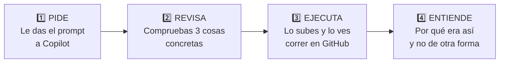
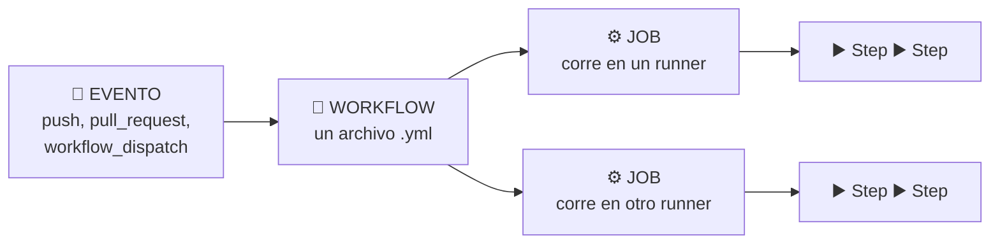

<div align="center">

# 🏢 Taller de GitHub Actions · Edición Enterprise

### De cero a un pipeline completo, en una hora, con Copilot de copiloto


**No vas a escribir YAML a mano. Se lo vas a pedir a Copilot y vas a aprender a revisarlo.**

</div>

---

## 📑 Tabla de contenidos

| | Sección | ⏱️ |
|---|---------|----|
| 🎯 | [Qué vas a construir](#-qué-vas-a-construir) | — |
| 🤖 | [Cómo funciona este taller](#-cómo-funciona-este-taller) | 5 min |
| 🧠 | [Lo mínimo que hay que saber](#-lo-mínimo-que-hay-que-saber) | 5 min |
| 🏢 | [Antes de empezar](#-antes-de-empezar) | Previo |
| 1️⃣ | [Módulo 1 · Tu primer workflow](#1️⃣-módulo-1--tu-primer-workflow) | 8 min |
| 2️⃣ | [Módulo 2 · Integración continua](#2️⃣-módulo-2--integración-continua) | 15 min |
| 3️⃣ | [Módulo 3 · Artefactos y resumen](#3️⃣-módulo-3--artefactos-y-resumen) | 8 min |
| 4️⃣ | [Módulo 4 · Proteger la rama main](#4️⃣-módulo-4--proteger-la-rama-main) | 12 min |
| 5️⃣ | [Módulo 5 · Push protection](#5️⃣-módulo-5--push-protection) | 8 min |
| 6️⃣ | [Módulo 6 · Releases automáticos](#6️⃣-módulo-6--releases-automáticos) | 10 min |
| ➕ | [Extras opcionales](#-extras-opcionales) | +30 min |
| 📖 | [Referencia rápida](#-referencia-rápida) | — |
| 🚧 | [Políticas de tu organización](#-políticas-de-tu-organización) | — |
| ✅ | [Checklist final](#-checklist-final) | — |
| 🎓 | [Para quien imparte el taller](#-para-quien-imparte-el-taller) | — |
| 📚 | [Recursos](#-recursos) | — |

---

## 🎯 Qué vas a construir

En **una hora**, dentro de **tu organización**, en un repositorio **privado o
interno**:

| | Resultado |
|---|-----------|
| ⚙️ | Un pipeline que **compila y prueba** en cada push y en cada pull request |
| 📦 | **Reportes descargables** y un resumen legible de cada ejecución |
| 🛡️ | La rama `main` **protegida**: sin CI en verde no hay merge |
| 🔒 | **Push protection** activo: GitHub te impide subir un secreto |
| 🏷️ | Un **release publicado solo** al empujar un tag |
| 🔐 | Todo con **permisos mínimos** y **cero acciones de terceros** |

### 🏢 Por qué una edición Enterprise

Porque un taller hecho en una cuenta personal no te prepara para el trabajo. Aquí
todo está pensado para una organización real:

| Tema | Cómo lo tratamos |
|------|------------------|
| Repositorio | **Privado o interno**, en tu organización |
| Acciones | **Solo `actions/*`**: sobrevive a una lista blanca |
| Releases | **GitHub CLI**, que ya viene en el runner |
| Permisos | **Explícitos por job**, nunca `write-all` |
| Secretos | **Push protection**, con un ejercicio real |
| Copilot | **En todos los pasos** |

---

## 🤖 Cómo funciona este taller

Este taller usa un método distinto al habitual: **no copias YAML, se lo pides a
Copilot**. Cada paso tiene la misma forma.



### ✍️ El paso que no puedes saltarte: revisar

Copilot escribe el YAML en segundos. **Tu trabajo es el otro**: saber si lo que
escribió está bien. Por eso cada módulo te dice **exactamente qué revisar**.

Esto es lo que Copilot suele equivocar, y lo que vas a aprender a detectar:

| ❌ Lo que suele proponer | ✅ Lo correcto | Por qué importa en tu empresa |
|-------------------------|---------------|-------------------------------|
| `actions/checkout@v2` | Una versión vigente | Las versiones viejas dejan de recibir parches |
| `permissions: write-all` | Solo lo que necesitas | Tu equipo de seguridad lo va a rechazar |
| Una acción del Marketplace | `actions/*` o un comando | Puede estar bloqueada por política |
| Olvidar `actions/checkout` | Ponerlo siempre primero | El runner nace vacío |
| `uses: ...@main` | Un tag o un SHA | `@main` es un blanco móvil |

> [!TIP]
> **Dile a Copilot lo que quieres, no cómo hacerlo.** Un prompt que dice
> *«compila y prueba el proyecto en cada PR, con permisos mínimos»* da mejor
> resultado que uno que lista pasos. Y si no te gusta lo que sale, responde
> *«usa permisos mínimos y solo acciones de actions/*»* en vez de arreglarlo a mano.

### 🛠️ Dónde usar Copilot

| Dónde | Para qué |
|-------|----------|
| **Chat del editor** | Generar y corregir el YAML. Es donde más lo vas a usar |
| **Botón «Explain error»** | En un run fallido o en la caja de checks del PR |
| **`Reviewers → Copilot`** | Que revise tu pull request |

---

## 🧠 Lo mínimo que hay que saber

Cinco palabras. Todo lo demás se construye sobre esto.



| 🔑 | Qué es | Dónde vive |
|----|--------|------------|
| **Evento** | Lo que dispara todo: un push, un PR, un tag, un botón | `on:` |
| **Workflow** | Un archivo YAML con la receta | `.github/workflows/*.yml` |
| **Job** | Pasos que corren juntos en **una máquina limpia** | `jobs:` |
| **Runner** | La máquina. Nace vacía y **se destruye al terminar** | `runs-on:` |
| **Step** | Un comando (`run:`) o una acción de otro (`uses:`) | `steps:` |

### 🧩 Las cuatro ideas que cuesta interiorizar

> [!WARNING]
> **1 · El runner nace vacío.** No tiene tu código. Por eso casi todo workflow
> empieza con `actions/checkout`.
>
> **2 · Los jobs no comparten disco.** Cada uno es una máquina distinta. Para
> pasar archivos se usan **artefactos**; para textos cortos, **outputs**.
>
> **3 · Todo se destruye al final.** Si quieres conservar algo, **súbelo** antes
> de que el job termine.
>
> **4 · 🏢 Tu workflow no vive solo.** Empresa → organización → repositorio: tres
> capas de política mandan sobre tu YAML, y **la más restrictiva gana**.

---
## 🏢 Antes de empezar

> ⏱️ **Haz esto antes de la sesión.** Si lo dejas para el día, se te va media hora.

### 1 · Instala tres herramientas

| Herramienta | Comprobación | Dónde |
|-------------|--------------|-------|
| **SDK de .NET 10** | `dotnet --version` | [dotnet.microsoft.com](https://dotnet.microsoft.com/download) |
| **Git** | `git --version` | [git-scm.com](https://git-scm.com/downloads) |
| **GitHub CLI** | `gh --version` | [cli.github.com](https://cli.github.com) |

Y **Visual Studio Code** con [GitHub Copilot](https://marketplace.visualstudio.com/items?itemName=GitHub.copilot)
y la extensión de [GitHub Actions](https://marketplace.visualstudio.com/items?itemName=GitHub.vscode-github-actions).

### 2 · Autentícate

```bash
gh auth login
gh api user/orgs --jq '.[].login'     # debes ver tu organización
```

> [!NOTE]
> Si tu empresa usa **SSO**, puede que tengas que autorizar el token para la
> organización. GitHub te da el enlace en el propio mensaje de error.

### 3 · Crea tu copia desde la plantilla

```bash
gh repo create MI-ORG/taller-workflows-TU-USUARIO \
  --template PROPIETARIO/github-workflows-workshop-fundamentos-enterprise \
  --private --clone

cd taller-workflows-TU-USUARIO
```

O desde el navegador: botón **Use this template** → **Create a new repository**,
eligiendo **tu organización** como *Owner* y visibilidad **Private** o **Internal**.

> [!WARNING]
> **No uses fork.** En las organizaciones nuevas, el fork de repositorios
> privados e internos viene deshabilitado por omisión.

### 4 · Comprueba que todo arranca

```bash
dotnet test TallerWorkflows.sln        # 20 pruebas en verde
gh api repos/MI-ORG/TU-REPO/actions/permissions
```

Lo que quieres ver:

```json
{ "enabled": true, "allowed_actions": "all" }
```

Si dice otra cosa, ve a [Políticas de tu organización](#-políticas-de-tu-organización).

### 🚲 El proyecto

`ContosoBiker.Tarifas`: una librería de .NET que calcula el costo de rentar una
bicicleta. Existe para que tu pipeline tenga **algo real que compilar y probar**.
No necesitas saber C#.

| Regla | Detalle |
|-------|---------|
| 💰 Subtotal | `tarifa diaria × días` |
| 🎁 Descuento semanal | **15 %** desde **7 días** |
| ⏰ Recargo por retraso | **10 %** de la tarifa por hora |

---

## 1️⃣ Módulo 1 · Tu primer workflow

> ⏱️ **8 minutos** · Entender la anatomía y ejecutarlo

### 🤖 Paso 1 · Pídeselo a Copilot

Crea el archivo `.github/workflows/00-hola.yml`, ábrelo, y pídele a Copilot:

```text
Crea un workflow de GitHub Actions llamado "00 · Hola workflows" que:
- Se ejecute solo manualmente, y pida un input llamado "nombre"
- Declare permisos mínimos: solo lectura de contenido
- Tenga un job en ubuntu-latest que salude con ese nombre
- Y que imprima el repositorio, la rama, el evento y quién lo ejecutó
Usa solo acciones oficiales de GitHub.
```

### ✅ Paso 2 · Revisa estas tres cosas

| Revisa | Debe decir | Por qué |
|--------|------------|---------|
| El disparador | `workflow_dispatch:` | Es lo que hace aparecer el botón |
| Los permisos | `permissions: contents: read` | Explícito, no heredado |
| El runner | `runs-on: ubuntu-latest` | Una etiqueta que existe |

<details>
<summary>📄 <b>Compara con la referencia</b></summary>

```yaml
name: 00 · Hola workflows

on:
  workflow_dispatch:
    inputs:
      nombre:
        description: "¿Cómo te llamas?"
        required: true
        default: "ciclista"

permissions:
  contents: read

jobs:
  saludar:
    name: Saludar y mostrar el contexto
    runs-on: ubuntu-latest

    steps:
      - name: Saludar a la persona
        run: echo "¡Hola, ${{ inputs.nombre }}! Bienvenido a GitHub Actions."

      - name: Mostrar el contexto
        run: |
          echo "Repositorio  : ${{ github.repository }}"
          echo "Organización : ${{ github.repository_owner }}"
          echo "Rama         : ${{ github.ref_name }}"
          echo "Evento       : ${{ github.event_name }}"
          echo "Ejecutado por: ${{ github.actor }}"
```

Este archivo ya viene en el repositorio como
[`.github/workflows/00-hola-workflows.yml`](.github/workflows/00-hola-workflows.yml).

</details>

### ▶️ Paso 3 · Ejecútalo

```bash
git add .github/workflows/
git commit -m "ci: primer workflow"
git push
```

Y dispáralo:

```bash
gh workflow run "00 · Hola workflows" -f nombre="Ana"
gh run watch
```

O desde la web: pestaña **Actions** → **00 · Hola workflows** → **Run workflow**.

### 💡 Paso 4 · Por qué era así

| Decisión | Razón |
|----------|-------|
| `workflow_dispatch` | El botón **solo aparece** si el archivo ya está en `main` |
| `permissions` explícito | El valor por omisión lo decide **tu organización**. Declararlo hace que funcione igual en cualquier repo |
| `${{ }}` | Son **expresiones**: GitHub las evalúa antes de ejecutar el comando |

---
## 2️⃣ Módulo 2 · Integración continua

> ⏱️ **15 minutos** · El módulo más importante del taller

### 🎯 Qué vas a lograr

Que el proyecto se compile y se pruebe **solo**, en cada push y en cada pull
request. Y vas a **verlo fallar a propósito**, porque ahí está todo el valor.

### 🤖 Paso 1 · Pídeselo a Copilot

El repositorio ya trae
[`.github/workflows/01-integracion-continua.yml`](.github/workflows/01-integracion-continua.yml).
Ábrelo y compáralo con lo que Copilot genera desde cero:

```text
Crea un workflow de GitHub Actions llamado "01 · Integración continua" que:
- Se dispare en push a main, en pull request contra main, y también manualmente
- Declare permisos mínimos a nivel de workflow
- Use una variable de entorno para la versión del SDK de .NET (10.0.x)
- En un job en ubuntu-latest: descargue el código, instale .NET,
  restaure, compile en Release y ejecute las pruebas
- Evita recompilar: usa --no-restore y --no-build donde corresponda
La solución es TallerWorkflows.sln. Usa solo acciones de actions/*.
```

### ✅ Paso 2 · Revisa estas cuatro cosas

| Revisa | Debe estar | Si falta o está mal |
|--------|------------|---------------------|
| **`actions/checkout` primero** | Siempre | Sin él, `dotnet` no encuentra nada |
| **Versión de las acciones** | Un tag vigente, nunca `@main` | Copilot suele proponer versiones viejas |
| **`permissions`** | `contents: read` | Si pone `write-all`, córrigelo |
| **`--no-restore` / `--no-build`** | En compilar y probar | Sin ellos, el pipeline tarda el doble |

<details>
<summary>📄 <b>Compara con la referencia</b></summary>

```yaml
name: 01 · Integración continua

on:
  push:
    branches: ["main"]
  pull_request:
    branches: ["main"]
  workflow_dispatch:

permissions:
  contents: read

env:
  VERSION_DOTNET: "10.0.x"

jobs:
  construir-y-probar:
    name: Construir y probar
    runs-on: ubuntu-latest

    steps:
      - name: Descargar el código
        uses: actions/checkout@v7

      - name: Instalar el SDK de .NET
        uses: actions/setup-dotnet@v6
        with:
          dotnet-version: ${{ env.VERSION_DOTNET }}

      - name: Restaurar dependencias
        run: dotnet restore TallerWorkflows.sln

      - name: Compilar
        run: dotnet build TallerWorkflows.sln --configuration Release --no-restore

      - name: Ejecutar pruebas
        run: dotnet test TallerWorkflows.sln --configuration Release --no-build
```

</details>

### ▶️ Paso 3 · Dispáralo con un cambio real

Pídele a Copilot el código, para no escribirlo tú:

```text
En src/ContosoBiker.Tarifas/CalculadoraTarifas.cs agrega un método público
estático AplicarTarifaFinDeSemana(decimal tarifaDiaria) que devuelva la tarifa
con un 20 % de recargo, redondeada a 2 decimales con MidpointRounding.AwayFromZero,
y que lance ArgumentOutOfRangeException si la tarifa es negativa.

Y en tests/ContosoBiker.Tarifas.Tests/CalculadoraTarifasTests.cs agrega una
prueba xUnit que verifique que 120 se convierte en 144.
```

Comprueba y sube:

```bash
dotnet test TallerWorkflows.sln
git switch -c feature/tarifa-fin-de-semana
git add .
git commit -m "feat: tarifa de fin de semana con 20 % de recargo"
git push -u origin feature/tarifa-fin-de-semana
gh pr create --fill --base main
```

En el PR aparece la caja de verificaciones. En un minuto: ✅ **All checks have passed**.

### 💥 Paso 4 · Ahora rómpelo (este paso es el que enseña)

Cambia el recargo de `1.20m` a `1.50m` **sin tocar la prueba**:

```bash
git commit -am "fix: subir el recargo"
git push
```

El PR se pone ❌ rojo:

```text
Failed AplicarTarifaFinDeSemana_AgregaVeintePorCiento
   Expected: 144
   Actual:   180.00
```

**Eso es la integración continua**: el error te llegó en 60 segundos, en el PR,
antes de que nadie hiciera merge.

### 🤖 Paso 5 · Que Copilot te explique el fallo

Antes de arreglarlo, junto al check en rojo busca el botón para que **Copilot
explique el error**. También está arriba en la página del run.

Es el atajo que más vas a usar cuando el log tenga 400 líneas y lo que importa
esté enterrado en medio.

Vuelve a `1.20m`, haz push, y cuando esté en verde:

```bash
gh pr merge --squash --delete-branch
```

### 💡 Paso 6 · Por qué era así

| Decisión | Razón |
|----------|-------|
| `pull_request` además de `push` | El PR ejecuta una **fusión temporal** con `main`, así detecta conflictos de integración |
| Versiones fijadas (`@v7`) | `@main` es un blanco móvil que controla otra persona |
| `permissions: contents: read` | Este workflow solo lee. Nunca pidas más de lo que usas |

> [!IMPORTANT]
> 🏢 **Tu empresa puede exigir fijar por SHA completo.** Si la política
> *«Require actions to be pinned to a full-length commit SHA»* está activa,
> `@v7` se rechaza y necesitas los 40 caracteres:
>
> ```bash
> gh api repos/actions/checkout/git/ref/tags/v7 --jq .object.sha
> ```
>
> Dependabot sabe actualizar también los SHA, así que fijarlos no te deja atrás.

---

## 3️⃣ Módulo 3 · Artefactos y resumen

> ⏱️ **8 minutos**

### 🎯 Qué vas a lograr

Sacar del runner un reporte descargable, y un resumen legible en la portada de
cada ejecución.

> [!IMPORTANT]
> **El runner se destruye al terminar.** El reporte que genera `dotnet test`
> existe solo dentro de esa máquina. Si no lo subes, desaparece.

### 🤖 Paso 1 · Pídeselo a Copilot

Con el workflow de CI abierto:

```text
Modifica este workflow para que:
1. dotnet test genere un reporte trx en una carpeta "reportes"
2. Suba esa carpeta como artefacto llamado "reporte-de-pruebas",
   con retención de 7 días, y que se suba AUNQUE las pruebas fallen
3. Escriba en el resumen de la ejecución una tabla markdown con la rama,
   el commit, el evento y si terminó en verde o en rojo
Usa solo acciones de actions/*.
```

### ✅ Paso 2 · Revisa estas dos cosas

| Revisa | Debe decir | Por qué es crítico |
|--------|------------|--------------------|
| **`if: always()`** | En los dos steps finales | Sin esto, el reporte **solo se sube cuando todo va bien**, o sea cuando no lo necesitas |
| **`>> "$GITHUB_STEP_SUMMARY"`** | Con `>>`, no con `>` | `>` borra el archivo en vez de añadir |

<details>
<summary>📄 <b>Compara con la referencia</b></summary>

```yaml
      - name: Ejecutar pruebas y generar reporte
        run: |
          dotnet test TallerWorkflows.sln \
            --configuration Release \
            --no-build \
            --logger "trx;LogFileName=resultados.trx" \
            --results-directory reportes

      - name: Guardar el reporte de pruebas
        if: always()
        uses: actions/upload-artifact@v7
        with:
          name: reporte-de-pruebas
          path: reportes/
          retention-days: 7

      - name: Escribir el resumen de la ejecución
        if: always()
        run: |
          {
            echo "## 🚲 Resultado de la integración continua"
            echo ""
            echo "| Dato | Valor |"
            echo "| --- | --- |"
            echo "| Rama | \`${{ github.ref_name }}\` |"
            echo "| Commit | \`${{ github.sha }}\` |"
            echo "| Evento | \`${{ github.event_name }}\` |"
            echo "| Resultado | ${{ job.status == 'success' && '✅ verde' || '❌ rojo' }} |"
          } >> "$GITHUB_STEP_SUMMARY"
```

</details>

### ▶️ Paso 3 · Pruébalo

```bash
git add .github/workflows/
git commit -m "ci: guardar el reporte y escribir el resumen"
git push
```

En la ejecución verás **arriba** tu tabla renderizada y **abajo** la sección
**Artifacts** con el reporte descargable.

### 💡 Paso 4 · Por qué era así

| Condición | Cuándo corre el step |
|-----------|----------------------|
| *(sin condición)* | Solo si todo lo anterior salió bien |
| `if: always()` | **Siempre**, incluso si algo falló |
| `if: failure()` | Solo si algo falló |

> [!TIP]
> 🏢 **`retention-days` importa en una empresa.** Los artefactos consumen el
> almacenamiento de tu organización, compartido con Packages. Para reportes de
> PR, entre **1 y 7 días** es razonable. El valor por omisión puede ser 90.

---
## 4️⃣ Módulo 4 · Proteger la rama main

> ⏱️ **12 minutos** · Aquí el pipeline deja de avisar y empieza a detener

### 🎯 Qué vas a lograr

Que `main` no acepte cambios directos, y que **ningún PR pueda mergearse con el
pipeline en rojo**.

> [!NOTE]
> 🏢 Los rulesets funcionan en repositorios **privados e internos** con GitHub
> Team y Enterprise Cloud. No necesitas hacer público nada, y te basta con ser
> administrador de **tu** repositorio, cosa que ya eres por haberlo creado.

### 🔧 Paso 1 · Crea el ruleset

**Settings → Rules → Rulesets → New ruleset → New branch ruleset**

| Campo | Valor |
|-------|-------|
| **Ruleset Name** | `Proteger main` |
| **Enforcement status** | `Active` ⚠️ en *Evaluate* no bloquea nada |
| **Target branches** | **Include default branch** |

Marca estas reglas:

| ☑️ | Qué logra |
|---|-----------|
| **Restrict deletions** | Nadie borra `main` |
| **Block force pushes** | Nadie reescribe la historia |
| **Require a pull request before merging** | Todo cambio pasa por un PR |
| └ *Required approvals:* `0` | En el taller trabajas solo |
| **Require status checks to pass** | 👉 añade el check **`Construir y probar`** |

> [!IMPORTANT]
> En la lista aparece el **`name:` del job**, no el del workflow. Y solo aparece
> si **ya se ejecutó una vez**. Si no lo encuentras, es que aún no ha corrido.

<details>
<summary>💻 <b>¿Prefieres hacerlo por terminal?</b></summary>

Pídeselo a Copilot:

```text
Dame el JSON para crear un ruleset de rama en GitHub vía API REST que:
proteja la rama por defecto, esté activo, impida borrado y force push,
exija pull request con 0 aprobaciones, y exija el status check
"Construir y probar". Y dame el comando gh api para aplicarlo.
```

El resultado debería parecerse a esto:

```json
{
  "name": "Proteger main",
  "target": "branch",
  "enforcement": "active",
  "conditions": { "ref_name": { "include": ["~DEFAULT_BRANCH"], "exclude": [] } },
  "rules": [
    { "type": "deletion" },
    { "type": "non_fast_forward" },
    { "type": "pull_request", "parameters": {
        "required_approving_review_count": 0,
        "require_code_owner_review": false,
        "dismiss_stale_reviews_on_push": false,
        "require_last_push_approval": false,
        "required_review_thread_resolution": false } },
    { "type": "required_status_checks", "parameters": {
        "strict_required_status_checks_policy": true,
        "required_status_checks": [{ "context": "Construir y probar" }] } }
  ]
}
```

```bash
gh api --method POST repos/MI-ORG/TU-REPO/rulesets --input ruleset.json
```

</details>

### ▶️ Paso 2 · Comprueba que bloquea

```bash
git switch main
echo "prueba" >> README.md
git commit -am "test: push directo a main"
git push
```

```text
! [remote rejected] main -> main (protected branch hook declined)
```

🎉 Funciona. Deshazlo:

```bash
git reset --hard origin/main
```

### 🛡️ Paso 3 · Ve el bloqueo del merge

Crea una rama que rompa las pruebas:

```bash
git switch -c feature/tarifa-rota
```

Cambia el descuento en `src/ContosoBiker.Tarifas/CalculadoraTarifas.cs`:

```diff
-    public const decimal PorcentajeDescuentoSemanal = 0.15m;
+    public const decimal PorcentajeDescuentoSemanal = 0.25m;
```

```bash
git commit -am "feat: subir el descuento al 25 %"
git push -u origin feature/tarifa-rota
gh pr create --fill --base main
```

En el PR:

```text
❌ Construir y probar — Failing        Required

🔒 Merging is blocked
```

El botón de merge está **gris**. No es un aviso: es un bloqueo.

Verás que fallaron **dos** pruebas, no una: `CalcularTotal` usa internamente el
mismo descuento. Eso es realista — cambiar una regla de negocio casi nunca
afecta a una sola prueba.

### 🤖 Paso 4 · Que Copilot arregle las pruebas

```text
El descuento semanal cambió de 15 % a 25 %. Actualiza las pruebas de
CalculadoraTarifasTests.cs que fallan para reflejar el nuevo valor.
```

Debería dejar `630m` y `654m`. Comprueba y sube:

```bash
dotnet test TallerWorkflows.sln
git commit -am "test: ajustar las pruebas al nuevo descuento"
git push
```

El check pasa a ✅ y el botón de merge se habilita. **Ese es el ciclo completo.**

### 🔐 Extra rápido · CODEOWNERS con equipos

Edita [`.github/CODEOWNERS`](.github/CODEOWNERS). En una organización, usa
**equipos**, no personas: si pones a alguien concreto, el día que esté de
vacaciones bloquea a todo el mundo.

```text
*                       @mi-org/mi-equipo
/.github/workflows/     @mi-org/plataforma
```

```bash
gh api user/teams --jq '.[] | "@\(.organization.login)/\(.slug)"'
```

> [!WARNING]
> El equipo necesita **acceso de escritura** al repositorio. Si no lo tiene,
> GitHub **ignora la línea en silencio**. La pestaña del archivo CODEOWNERS te
> marca los errores.

---

## 5️⃣ Módulo 5 · Push protection

> ⏱️ **8 minutos** · Que GitHub te impida subir un secreto

### 🎯 Qué vas a lograr

Intentar subir un secreto y que **el servidor te lo rechace**. No un aviso
después: un bloqueo antes de que el secreto llegue al repositorio.

### 🧠 Por qué esto importa más que todo lo anterior

Un pipeline roto se arregla. **Un secreto filtrado hay que rotarlo**, y mientras
tanto alguien puede usarlo. Y si llegó a la historia de Git, borrarlo del último
commit no basta: sigue ahí.

| | Secret scanning | Push protection |
|---|-----------------|-----------------|
| Cuándo actúa | **Después** de subirlo | **Antes** de subirlo |
| Qué hace | Te crea una alerta | **Rechaza el push** |
| El secreto llegó al repo | ✅ Sí, hay que rotarlo | ❌ No |

### 🔧 Paso 1 · Compruébalo y actívalo

```bash
gh api repos/MI-ORG/TU-REPO --jq '.security_and_analysis'
```

Lo que buscas:

```json
{
  "secret_scanning": { "status": "enabled" },
  "secret_scanning_push_protection": { "status": "enabled" }
}
```

Si está en `disabled`, actívalo en **Settings → Advanced Security**:
primero **Secret Protection → Enable**, después **Push protection → Enable**.

> [!IMPORTANT]
> 🏢 **Requisito de licencia.** En repositorios **privados o internos**, secret
> scanning y push protection requieren **GitHub Secret Protection** (antes parte
> de GitHub Advanced Security). En repositorios **públicos es gratis**.
>
> Puede activarlo un **administrador del repositorio**, siempre que la
> organización tenga licencias disponibles. Si el interruptor está bloqueado, es
> que lo gestiona una configuración de seguridad de la organización.

### 💥 Paso 2 · Intenta subir un secreto

GitHub publica un **token de prueba** que no da acceso a nada, pensado
exactamente para esto. Lo escribimos en **dos mitades** para que puedas pegarlo
sin que te bloquee antes de tiempo:

| Mitad | Valor |
|-------|-------|
| A | `secret_scanning_ab85fc6f8d76` |
| B | `38cf1c11da812da308d43_abcde` |

Pégalas **juntas, sin espacio ni guion**, en un archivo nuevo:

```bash
git switch -c test/push-protection
# Crea config.txt con una línea:  TOKEN=<mitad A><mitad B>
git add config.txt
git commit -m "test: probar push protection"
git push -u origin test/push-protection
```

> [!TIP]
> 🧠 **Por qué está partido en dos:** si escribiéramos el token completo en este
> README, **GitHub bloquearía el push de la propia documentación**. La
> documentación oficial de GitHub hace exactamente lo mismo por la misma razón.
> Es la mejor demostración de que esto funciona de verdad.

### 🛑 Paso 3 · Mira cómo te rechaza

```text
remote: error: GH013: Repository rule violations found for refs/heads/test/push-protection.
remote:
remote: - GITHUB PUSH PROTECTION
remote:   —————————————————————————————————————————
remote:     Resolve the following violations before pushing again
remote:
remote:     - Push cannot contain secrets
remote:
remote:       —— GitHub Secret Scanning ————————————————————————————
remote:        locations:
remote:          - commit: bb3587d6489d1ce3a50e06694ed7bdf367ccc924
remote:            path: config.txt:1
remote:
remote:        (?) To push, remove secret from commit(s) or follow this URL to allow the secret.
remote:        https://github.com/MI-ORG/TU-REPO/security/secret-scanning/unblock-secret/...
remote:
 ! [remote rejected] test/push-protection -> test/push-protection (push declined due to repository rule violations)
```

**El secreto nunca llegó a GitHub.** Ese es el punto.

### 🔑 Paso 4 · Las salidas, y cuál es la correcta

El mensaje te da un enlace para desbloquear, con tres motivos:

| Motivo | Qué pasa después |
|--------|------------------|
| *It's used in tests* | La alerta se cierra como «usado en pruebas» |
| *It's a false positive* | La alerta se cierra como falso positivo |
| *I'll fix it later* | La alerta **queda abierta** |

> [!CAUTION]
> **Saltarse el bloqueo no es gratis.** GitHub crea una alerta, **lo registra en
> el log de auditoría** y avisa por correo a los propietarios de la organización
> y a los security managers. Si tu empresa usa **bypass delegado**, ni siquiera
> puedes saltártelo: tienes que **pedir permiso** y alguien lo aprueba o lo
> rechaza.

**La salida correcta casi siempre es quitar el secreto.** Hazlo así:

```bash
git reset --hard HEAD~1
git switch main
git branch -D test/push-protection
```

### 💡 Paso 5 · Lo que acabas de aprender

| | |
|---|---|
| 🔒 | Un secreto se bloquea **antes** de entrar, no se limpia después |
| 📋 | Saltarse el bloqueo **deja rastro auditable** |
| 🧪 | Un token **inventado** no dispara el bloqueo: los tokens reales llevan una suma de verificación. Por eso hay un token de prueba oficial |
| 🤝 | Convive con el ruleset del módulo anterior: uno protege la rama, el otro el contenido |

> [!TIP]
> 🤖 Pregúntale a Copilot: *«¿qué otras protecciones de seguridad puedo activar
> en este repositorio y qué hace cada una?»* Te va a hablar de secret scanning,
> code scanning, Dependabot y Copilot Autofix.

---
## 6️⃣ Módulo 6 · Releases automáticos

> ⏱️ **10 minutos** · Cierre del taller

### 🎯 Qué vas a lograr

Que al empujar un tag `v1.0.0`, GitHub compile, empaquete y publique un release
con el archivo adjunto y las notas escritas solas. **Sin acciones de terceros.**

### 🏢 Por qué aquí no usamos el Marketplace

Lo habitual sería una acción como `softprops/action-gh-release`. En una
organización eso tiene dos pegas: si hay **lista blanca**, el workflow falla al
resolver el `uses:`; y muchas empresas exigen **auditar** cada acción externa.

La alternativa no tiene ninguna: **GitHub CLI ya viene instalado en el runner**.

```yaml
# ❌ Depende de un tercero, puede estar bloqueado
- uses: softprops/action-gh-release@v3

# ✅ Usa lo que el runner ya trae
- run: gh release create "$GITHUB_REF_NAME" --generate-notes
  env:
    GH_TOKEN: ${{ secrets.GITHUB_TOKEN }}
```

### 🤖 Paso 1 · Pídeselo a Copilot

Crea `.github/workflows/02-release.yml` y pide:

```text
Crea un workflow de GitHub Actions llamado "02 · Publicar release" que:
- Se dispare solo al empujar tags con formato v*.*.*
- Tenga permisos de solo lectura a nivel de workflow, y que SOLO el job
  que publica tenga contents: write
- Compile en Release, ejecute las pruebas, y empaquete
  src/ContosoBiker.Tarifas/ContosoBiker.Tarifas.csproj con dotnet pack,
  usando como versión el nombre del tag sin la "v" inicial
- Publique el release con GitHub CLI (no uses acciones del Marketplace),
  adjuntando el .nupkg y generando las notas automáticamente
Usa solo acciones de actions/*.
```

### ✅ Paso 2 · Revisa estas tres cosas

| Revisa | Debe estar | Si falta |
|--------|------------|----------|
| **`GH_TOKEN`** | `env:` en el step de `gh` | `gh` falla: no se autentica solo |
| **`contents: write` en el job** | No en el workflow entero | La escritura debe vivir solo donde se usa |
| **Nada de `uses:` de terceros** | Solo `actions/*` | Puede estar bloqueado por política |

<details>
<summary>📄 <b>Compara con la referencia</b></summary>

```yaml
name: 02 · Publicar release

on:
  push:
    tags:
      - "v*.*.*"

permissions:
  contents: read

jobs:
  publicar:
    name: Empaquetar y publicar
    runs-on: ubuntu-latest

    permissions:
      contents: write

    steps:
      - name: Descargar el código
        uses: actions/checkout@v7

      - name: Instalar el SDK de .NET
        uses: actions/setup-dotnet@v6
        with:
          dotnet-version: "10.0.x"

      - name: Leer la versión del tag
        id: version
        run: echo "numero=${GITHUB_REF_NAME#v}" >> "$GITHUB_OUTPUT"

      - name: Compilar en Release
        run: dotnet build TallerWorkflows.sln --configuration Release

      - name: Ejecutar pruebas
        run: dotnet test TallerWorkflows.sln --configuration Release --no-build

      - name: Empaquetar la librería
        run: |
          dotnet pack src/ContosoBiker.Tarifas/ContosoBiker.Tarifas.csproj \
            --configuration Release \
            --no-build \
            -p:PackageVersion=${{ steps.version.outputs.numero }} \
            --output paquetes

      - name: Publicar el release en GitHub
        env:
          GH_TOKEN: ${{ secrets.GITHUB_TOKEN }}
        run: |
          gh release create "$GITHUB_REF_NAME" \
            paquetes/*.nupkg \
            --title "Contoso Biker Tarifas $GITHUB_REF_NAME" \
            --generate-notes
```

</details>

### ▶️ Paso 3 · Publícalo

Súbelo por PR, porque `main` ya está protegida:

```bash
git switch -c ci/release
git add .github/workflows/02-release.yml
git commit -m "ci: publicar release al empujar un tag"
git push -u origin ci/release
gh pr create --fill --base main
gh pr merge --squash --delete-branch    # cuando el check esté verde
```

Y empuja el tag:

```bash
git switch main && git pull
git tag -a v1.0.0 -m "Primera versión estable"
git push origin v1.0.0
```

> [!TIP]
> `git push` **no** envía los tags. Hay que nombrarlos. Es la razón número uno
> de *«empujé el tag y no pasó nada»*.

Comprueba el resultado:

```bash
gh release view v1.0.0
```

### 💡 Paso 4 · Por qué era así

| Decisión | Razón |
|----------|-------|
| `tags: ["v*.*.*"]` | Sin el filtro, **cualquier** tag publicaría un release |
| `contents: write` en el job | La ventana de escritura dura lo mínimo |
| Pruebas también aquí | Un release es lo único que tus usuarios descargan |
| `--generate-notes` | **Trazabilidad automática** de qué entró en cada versión |

### 🔐 Extra rápido · Proteger también los tags

Un release es un artefacto de auditoría: nadie debería poder reescribir un tag
publicado. Mismo mecanismo del Módulo 4, cambiando el objetivo:

**Settings → Rules → Rulesets → New tag ruleset** → *Target tags:* `v*` →
marca **Restrict creations**, **Restrict updates** y **Restrict deletions**.

---

<div align="center">

## 🎉 Terminaste la hora

Tu repositorio compila, prueba, reporta, bloquea merges en rojo, rechaza
secretos y publica releases. Con permisos mínimos y sin dependencias de terceros.

</div>

---

## ➕ Extras opcionales

> ⏱️ **+30 minutos** si tienes tiempo, o para después

<details>
<summary><b>⛓️ Dividir el pipeline en varios jobs</b></summary>

**El prompt:**

```text
Divide este workflow en tres jobs: "construir", "probar" y "resumen".
- construir: compila, lee la versión del .csproj y la exporta como output,
  empaqueta y sube el .nupkg como artefacto
- probar: depende de construir, ejecuta las pruebas y sube el reporte
- resumen: depende de los dos, corre siempre, descarga el artefacto del
  paquete y escribe una tabla con el resultado de cada etapa
```

**Lo que hay que revisar:** que `probar` **vuelva a compilar** en vez de
reutilizar los binarios de `construir`.

> [!WARNING]
> Trasplantar la compilación de .NET entre máquinas es frágil: el estado de
> NuGet y las rutas absolutas no viajan. El resultado típico es el peor de
> todos: **`dotnet test` termina en verde sin ejecutar ninguna prueba**.
>
> Entre jobs se pasan **entregables terminados** (el `.nupkg`), no estados
> intermedios. Para ahorrar tiempo se usa **caché**, no artefactos.

**Las tres piezas de un `output`:**

```yaml
# 1️⃣ El step escribe
  id: leer-version
  run: echo "version=0.1.0" >> "$GITHUB_OUTPUT"
# 2️⃣ El job lo declara
  outputs:
    version: ${{ steps.leer-version.outputs.version }}
# 3️⃣ Otro job lo consume (necesita needs:)
  ${{ needs.construir.outputs.version }}
```

Si falta cualquiera de las tres, el valor llega **vacío y sin error**.

🏢 **El motivo fuerte para dividir en una empresa son los permisos**: cada job
pide solo lo suyo, y la escritura no dura toda la ejecución.

> [!CAUTION]
> Nunca pases secretos por `outputs`: quedan visibles en la API y **GitHub no
> los enmascara**.

</details>

<details>
<summary><b>🔲 Matriz de sistemas operativos</b></summary>

```text
Convierte este job para que pruebe en ubuntu-latest, windows-latest y
macos-latest usando una matriz, y que si uno falla los demás sigan corriendo.
```

Lo clave es `fail-fast: false`: por omisión es `true` y el primer fallo cancela
el resto.

> [!WARNING]
> 🏢 Una matriz de 3 × 3 son **9 ejecuciones**. En repos privados consume
> minutos de tu organización, y Windows y macOS **cuestan más por minuto** que
> Linux.

</details>

<details>
<summary><b>⚡ Caché de dependencias</b></summary>

```text
Agrega caché de paquetes NuGet a este workflow usando actions/cache,
con una clave basada en el hash de los archivos .csproj.
```

| Pieza | Qué hace |
|-------|----------|
| `key` | La identidad del caché. Si cambia un `.csproj`, se regenera |
| `restore-keys` | Plan B: el caché más reciente que empiece igual |

`actions/setup-dotnet` ya trae caché con `cache: true`. El mecanismo es el mismo
para npm, pip o Maven.

</details>

<details>
<summary><b>🚦 Entornos con aprobación manual 🔐</b></summary>

Lo que más se parece a tu trabajo real: que un despliegue **espere a que alguien
autorizado apriete el botón**.

**Settings → Environments → New environment** → `produccion`, y activa
**Required reviewers**.

```yaml
jobs:
  desplegar:
    runs-on: ubuntu-latest
    environment: produccion      # 🔐 aquí se detiene y espera
    steps:
      - run: echo "Desplegando..."
```

> [!WARNING]
> **Crea el entorno primero.** Si referencias uno que no existe, GitHub **lo
> crea solo, sin protecciones**, y el job pasa de largo sin esperar a nadie. No
> falla ni avisa: simplemente no hay puerta. Compruébalo con:
>
> ```bash
> gh api repos/MI-ORG/TU-REPO/environments --jq '.environments[].name'
> ```

> [!IMPORTANT]
> En repos **privados o internos**, los *required reviewers* y el *wait timer*
> requieren **GitHub Enterprise**. Con Team o Pro solo funcionan en públicos.

</details>

<details>
<summary><b>♻️ Workflows reutilizables en la organización</b></summary>

Para no tener el mismo pipeline copiado en diez repositorios.

El que se deja llamar usa `on: workflow_call:`. El que llama:

```yaml
jobs:
  delegar:
    uses: mi-org/plantillas-ci/.github/workflows/ci.yml@v1
```

**El ajuste que todo el mundo olvida:** en el repositorio que **contiene** el
workflow, ve a **Settings → Actions → General → Access** y elige
**«Accessible from repositories in the 'MI-ORG' organization»**. Sin eso, el
error de acceso no menciona este ajuste por ningún lado.

| Regla | Detalle |
|-------|---------|
| Anidamiento | Máximo 4 niveles |
| Permisos | Solo se mantienen o **reducen** hacia abajo |
| Redirecciones | **No** se soportan: renombrar el repo rompe los `uses:` |

Fija a un **tag**, no a `@main`: un cambio en el repo central se propagaría a
toda la empresa al instante.

</details>

<details>
<summary><b>🛡️ Más seguridad del pipeline</b></summary>

| # | Regla | Por qué |
|---|-------|---------|
| 1️⃣ | Fija versiones (`@v7` o SHA) | `@main` lo controla otra persona |
| 2️⃣ | `permissions` explícito, por job | El valor por omisión suele sobrar |
| 3️⃣ | Nunca secretos en el YAML ni en `outputs` | Los outputs no se enmascaran |
| 4️⃣ | Cuidado con `pull_request_target` | Ejecuta con escritura sobre código ajeno |
| 5️⃣ | Revisa los workflows como código | Por eso están en `CODEOWNERS` |

**Lo que tu organización probablemente ya tiene:**

| Función | Qué hace |
|---------|----------|
| **Push protection** | Lo del [Módulo 5](#5️⃣-módulo-5--push-protection): bloquea el push |
| **Secret scanning** | Alerta de credenciales ya subidas |
| **Dependabot** | PR cuando una dependencia tiene una vulnerabilidad |
| **Code scanning (CodeQL)** | Analiza el código en cada PR |
| **Copilot Autofix** | Propone la corrección de los hallazgos |

> [!NOTE]
> 🤖 **Copilot Autofix no requiere suscripción a Copilot.** Está en repos
> públicos, y en privados o internos de organizaciones con **GitHub Code
> Security**.

</details>

---
## 📖 Referencia rápida

### 🤖 Prompts que funcionan

| Lo que quieres | Prompt |
|----------------|--------|
| Un workflow nuevo | *«Crea un workflow que [objetivo]. Usa solo acciones de `actions/*` y permisos mínimos»* |
| Entender YAML ajeno | *«Explícame qué hace este workflow paso a paso»* |
| Reducir permisos | *«¿Qué permisos mínimos necesita este workflow? Ajústalos por job»* |
| Depurar | *«Este workflow falla con este error: [pega el log]. ¿Por qué?»* |
| Migrar | *«Convierte este pipeline de Azure DevOps a GitHub Actions»* |
| Endurecer | *«Fija todas las acciones de este workflow por SHA completo»* |

> [!TIP]
> Termina tus prompts con **«usa solo acciones de `actions/*` y permisos
> mínimos»**. Ahorra la mitad de las correcciones.

### 🔔 Disparadores

```yaml
on:
  push:
    branches: ["main"]
    paths: ["src/**"]           # solo si cambió algo en src/
  pull_request:
    branches: ["main"]
  workflow_dispatch:            # botón manual
  workflow_call:                # invocable desde otro workflow
  push:
    tags: ["v*.*.*"]            # al empujar un tag de versión
  schedule:
    - cron: "0 7 * * 1"         # lunes a las 07:00 UTC
```

### 🔐 Permisos

```yaml
permissions:
  contents: read        # leer el código (lo mínimo para checkout)
  contents: write       # crear releases, hacer push, mover tags
  packages: write       # publicar en GitHub Packages
  pull-requests: write  # comentar o etiquetar PRs
  id-token: write       # OIDC hacia la nube, sin credenciales guardadas
```

| Dónde | Alcance |
|-------|---------|
| Nivel del workflow | Todos los jobs lo heredan |
| Dentro de un job | **Solo ese job**. Lo recomendado en una empresa |
| `permissions: {}` | Ninguno. El más seguro si no tocas el repo |

### 🧭 Contextos

| Expresión | Contiene |
|-----------|----------|
| `${{ github.repository }}` | `propietario/repositorio` |
| `${{ github.repository_owner }}` | Tu organización |
| `${{ github.ref_name }}` | La rama o el tag |
| `${{ github.sha }}` | El SHA del commit |
| `${{ github.actor }}` | Quién lo disparó |
| `${{ github.event_name }}` | `push`, `pull_request`… |
| `${{ runner.os }}` | `Linux`, `Windows` o `macOS` |
| `${{ job.status }}` | `success`, `failure` o `cancelled` |
| `${{ needs.<job>.result }}` | Resultado de un job del que dependes |
| `${{ secrets.GITHUB_TOKEN }}` | El token temporal de la ejecución |

### 📁 Variables especiales

| Variable | Para qué |
|----------|----------|
| `$GITHUB_OUTPUT` | Exportar un valor: `echo "k=v" >> "$GITHUB_OUTPUT"` |
| `$GITHUB_ENV` | Variable para los steps siguientes |
| `$GITHUB_STEP_SUMMARY` | Markdown en la portada de la ejecución |
| `$GITHUB_REF_NAME` | La rama o el tag, sin el prefijo `refs/` |

### 💻 GitHub CLI

```bash
gh run list --limit 10              # últimas ejecuciones
gh run view --log-failed            # solo lo que falló ⭐
gh run watch                        # seguirla en vivo
gh run rerun --failed               # reintentar solo lo fallido
gh run download                     # descargar artefactos
gh release create v1.0.0 --generate-notes
```

**Para inspeccionar la configuración de tu organización:**

```bash
# ¿Actions habilitado? ¿Hay lista blanca?
gh api repos/MI-ORG/MI-REPO/actions/permissions

# ¿Qué acciones están permitidas?
gh api repos/MI-ORG/MI-REPO/actions/permissions/selected-actions

# ¿Secret scanning y push protection?
gh api repos/MI-ORG/MI-REPO --jq '.security_and_analysis'

# ¿Qué rulesets aplican aquí?
gh api repos/MI-ORG/MI-REPO/rulesets --jq '.[] | "\(.name) (\(.source_type))"'

# ¿A qué equipos pertenezco?
gh api user/teams --jq '.[] | "@\(.organization.login)/\(.slug)"'
```

---

## 🚧 Políticas de tu organización

En una empresa, **parte de los problemas no están en tu YAML**. Si el mensaje
dice `not allowed` o `disabled`, o el job nunca arranca, es una política.

| Lo que ves | Qué pedirle a tu administrador |
|------------|-------------------------------|
| `actions/checkout@v7 is not allowed to be used in...` | Que agregue `actions/*` a las acciones permitidas |
| `must be pinned to a full length commit SHA` | Nada: usa el SHA completo. Es buena práctica |
| `Actions is disabled for this repository` | Que habilite Actions en el repo, la org o la empresa |
| El job se queda 🟡 *Queued* para siempre | Qué **grupo de runners** usar en `runs-on` |
| `Resource not accessible by integration` | Nada: declara `permissions:` en tu workflow |
| No puedo crear el repo en la organización | Permiso de creación de repositorios |
| El interruptor de push protection está bloqueado | Licencias de **GitHub Secret Protection** |
| Hay reglas que no puedo editar | Nada: vienen de un ruleset de la organización |
| `SAML enforcement` al usar `gh` | Nada: autoriza el token con el enlace que te da |

### 💬 Cómo pedirlo bien

```text
Hola:

Estoy haciendo el taller de GitHub Actions en MI-ORG/taller-workflows-jperez.
El pipeline falla con:

  actions/checkout@v7 is not allowed to be used in MI-ORG/taller-workflows-jperez

Entiendo que viene de la política de acciones permitidas de la organización.
¿Sería posible permitir `actions/*`? Son las acciones oficiales de GitHub
(checkout, setup-dotnet, upload-artifact, cache).

Gracias.
```

> [!TIP]
> Incluye siempre **el error literal** y **el nombre del repositorio**. La
> petición que trae el error exacto se resuelve el mismo día.

---

## ✅ Checklist final

### ⚙️ Tu pipeline

- [ ] Corre solo en cada push a `main` y en cada pull request
- [ ] Compila y ejecuta las 20 pruebas
- [ ] Sube el reporte como artefacto, **también cuando falla**
- [ ] Escribe un resumen legible en la portada
- [ ] Declara `permissions:` de forma explícita

### 🛡️ Tu repositorio

- [ ] Vive en tu organización y es privado o interno
- [ ] `main` rechaza pushes directos
- [ ] Un PR en rojo **no se puede mergear**
- [ ] **Push protection activo**: probaste que rechaza un secreto
- [ ] `CODEOWNERS` apunta a un equipo, no a una persona

### 🏷️ Tus releases

- [ ] Empujar `v1.0.0` publica un release automáticamente
- [ ] Lo hace **sin ninguna acción de terceros**
- [ ] Adjunta el `.nupkg` y genera las notas solo

### 🧠 Lo que ya entiendes

- [ ] Evento, workflow, job, runner y step
- [ ] Por qué el runner nace vacío y necesita `checkout`
- [ ] Por qué los jobs no comparten disco
- [ ] Qué hace `if: always()` y cuándo es obligatorio
- [ ] Por qué se bloquea un secreto **antes** de subirlo
- [ ] Qué revisar siempre en el YAML que genera Copilot

### 🏢 Lo que ya entiendes de tu organización

- [ ] Que empresa, organización y repositorio mandan sobre tu YAML, en ese orden
- [ ] Cómo saber si hay lista blanca de acciones, y qué pedir
- [ ] Por qué se declaran permisos mínimos por job
- [ ] Que los rulesets funcionan en repos privados e internos
- [ ] Que saltarse push protection deja rastro auditable

---

## 🎓 Para quien imparte el taller

<details>
<summary><b>📋 Antes de la sesión</b></summary>

**Con quien administre la organización:**

- [ ] Que los participantes puedan **crear repositorios**
- [ ] Que la política de acciones permita **`actions/*`**
- [ ] Que los **runners hospedados** estén habilitados
- [ ] Que haya **licencias de GitHub Secret Protection** para el Módulo 5
- [ ] **Haz una prueba real del Módulo 5** en un repo privado de la organización:
      te toma 2 minutos y es el único paso que depende de licencias

**Con los participantes, días antes:**

- [ ] SDK de .NET 10, Git y GitHub CLI instalados
- [ ] `gh auth login` hecho, y `gh api user/orgs` mostrando la organización
- [ ] Copilot funcionando en su editor
- [ ] **Su repositorio ya creado** desde la plantilla

> [!IMPORTANT]
> La hora del taller **asume que «Antes de empezar» ya está hecho**. Si la gente
> llega a instalar cosas, se convierte en dos horas.

</details>

<details>
<summary><b>⏱️ Agenda de 60 minutos</b></summary>

| Minuto | Módulo | Modo |
|--------|--------|------|
| 00-05 | Cómo funciona el taller + conceptos | Tú expones |
| 05-13 | 1 · Primer workflow | Guiado, todos a la vez |
| 13-28 | 2 · Integración continua | Guiado + práctica ⭐ |
| 28-36 | 3 · Artefactos y resumen | Práctica |
| 36-48 | 4 · Proteger main | Guiado ⭐ |
| 48-56 | 5 · Push protection | Guiado ⭐ |
| 56-66 | 6 · Releases | Guiado + cierre |

Los tres ⭐ son los que no debes recortar: **ver el pipeline en rojo**, **ver el
merge bloqueado** y **ver el push rechazado**. Ahí está el valor del taller.

**Si tienes 90 minutos:** agrega los extras de jobs encadenados y entornos con
aprobación.

</details>

<details>
<summary><b>⚠️ Dónde se atora la gente</b></summary>

| # | Dónde | Qué hacer |
|---|-------|-----------|
| 1 | Llegan sin herramientas o sin repo | Confírmalo por adelantado. Es lo que más tiempo cuesta |
| 2 | Lista blanca bloquea `actions/checkout` | **Confírmalo con el admin antes**. Arruina sesiones |
| 3 | Módulo 4: no aparece el check en el ruleset | Solo aparece si el job ya corrió una vez |
| 4 | Módulo 5: el interruptor está bloqueado | Depende de licencias. Ten un repo público de respaldo |
| 5 | Módulo 6: `git push` no envía tags | Escríbelo en la pizarra: `git push origin v1.0.0` |

</details>

<details>
<summary><b>🧭 Decisiones de diseño</b></summary>

| Decisión | Razón |
|----------|-------|
| Copilot genera, tú revisas | Escribir YAML a mano no enseña nada y consume la mitad del tiempo |
| Un solo README | Nadie navega carpetas en vivo. `Ctrl+F` y estás donde necesitas |
| Una hora, seis módulos | Un taller de dos horas pierde a la gente en la segunda |
| Repos privados o internos | Es donde se trabaja. Y los rulesets ya no necesitan repos públicos |
| Cero acciones de terceros | Una lista blanca no debería arruinar el taller a mitad |
| Push protection con token oficial | Un token inventado **no** dispara el bloqueo |
| Hacer fallar las cosas a propósito | Un pipeline siempre verde no enseña nada |
| Sin secciones de «si algo falla» | El error se diagnostica con Copilot, que es más rápido y se lleva al trabajo |

</details>

---

## 📚 Recursos

| Recurso | Para qué |
|---------|----------|
| [GitHub Actions](https://docs.github.com/es/actions) | La documentación completa, en español |
| [Sintaxis de workflows](https://docs.github.com/es/actions/reference/workflow-syntax-for-github-actions) | La referencia de cada palabra clave |
| [Permisos del `GITHUB_TOKEN`](https://docs.github.com/es/actions/security-for-github-actions/security-guides/automatic-token-authentication) | Qué puede hacer el token y cómo limitarlo |
| [Rulesets](https://docs.github.com/es/repositories/configuring-branches-and-merges-in-your-repository/managing-rulesets/about-rulesets) | Protección de ramas y tags |
| [Push protection](https://docs.github.com/es/code-security/concepts/secret-security/push-protection) | Cómo funciona el bloqueo de secretos |
| [Guardar secretos de forma segura](https://docs.github.com/es/get-started/learning-to-code/storing-your-secrets-safely) | El tutorial del que sale el token de prueba |
| [Manual de GitHub CLI](https://cli.github.com/manual) | Todos los comandos `gh` |

### 🏢 Para organizaciones

| Recurso | Para qué |
|---------|----------|
| [Políticas de Actions en la empresa](https://docs.github.com/es/enterprise-cloud@latest/admin/policies/enforcing-policies-for-your-enterprise/enforcing-policies-for-github-actions-in-your-enterprise) | Acciones permitidas, runners, fijado por SHA |
| [Limitar Actions en la organización](https://docs.github.com/es/organizations/managing-organization-settings/disabling-or-limiting-github-actions-for-your-organization) | Dónde se configura la lista blanca |
| [Rulesets de organización](https://docs.github.com/es/organizations/managing-organization-settings/creating-rulesets-for-repositories-in-your-organization) | Una regla para muchos repositorios |
| [Compartir workflows en la organización](https://docs.github.com/es/actions/how-tos/reuse-automations/share-with-your-organization) | El ajuste de acceso que todos olvidan |
| [Activar push protection](https://docs.github.com/es/code-security/how-tos/secure-your-secrets/prevent-future-leaks/enable-push-protection) | Paso a paso, repo y organización |
| [Entornos y despliegues](https://docs.github.com/es/actions/how-tos/deploy/configure-and-manage-deployments/manage-environments) | Aprobaciones manuales y secretos por entorno |

### 🤖 Copilot

| Recurso | Para qué |
|---------|----------|
| [Revisión de código con Copilot](https://docs.github.com/es/copilot/concepts/agents/code-review) | Que revise tus PR |
| [Solucionar problemas de workflows](https://docs.github.com/es/actions/how-tos/troubleshoot-workflows) | El botón de explicación del error |
| [Copilot Autofix](https://docs.github.com/es/code-security/concepts/code-scanning/autofix-for-code-scanning) | Corregir hallazgos de seguridad |

---

<div align="center">

### 🚀 El siguiente paso

Lleva esto a un repositorio real de tu equipo. Empieza por lo mismo: **compilar
y probar en cada PR**. El resto se construye encima.


</div>