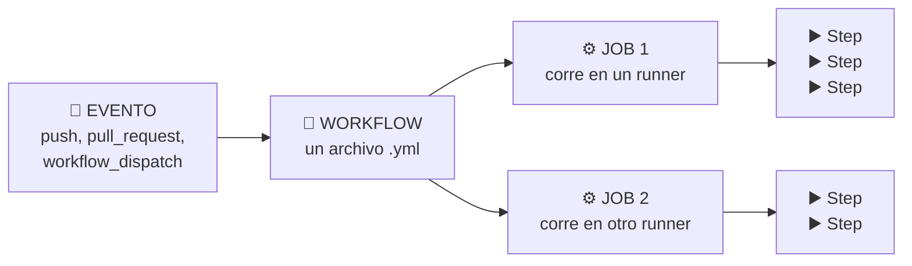
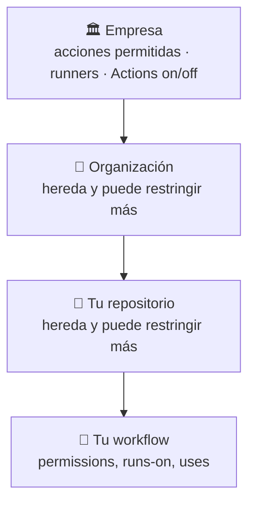
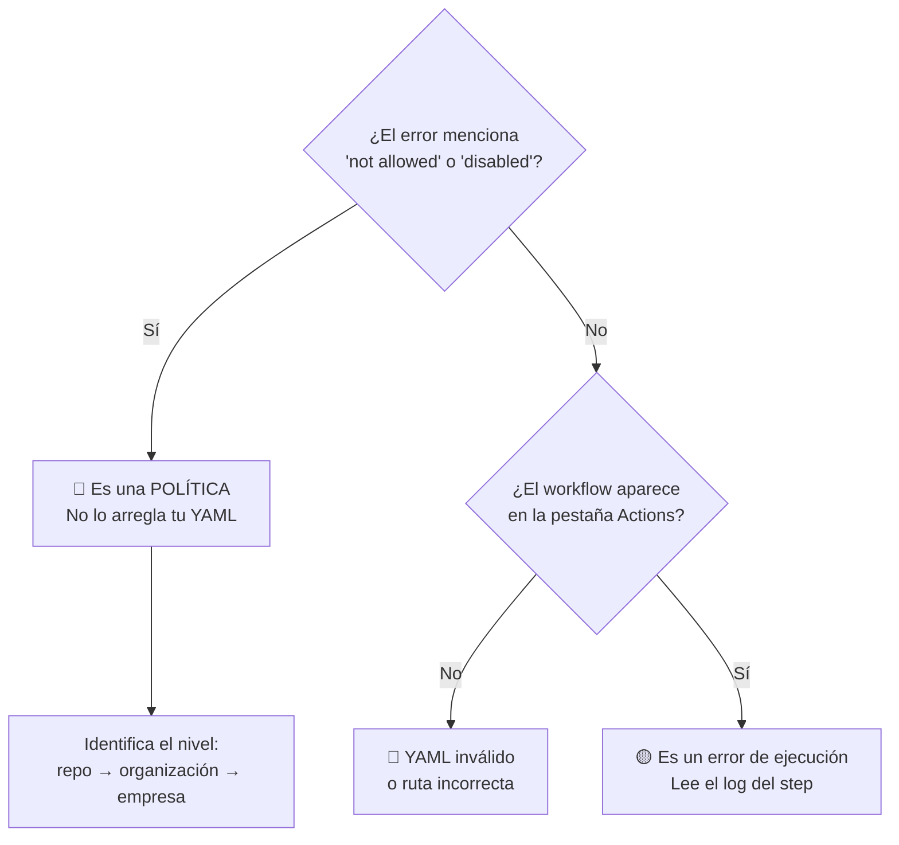

<div align="center">

# 🏢 Taller de GitHub Actions · Edición Enterprise

### Automatiza, protege y publica tu código dentro de tu organización


**Todo el taller vive en este único archivo. No tienes que abrir nada más.**

</div>

---

## 📑 Tabla de contenidos

| | Sección | Tiempo |
|---|---------|--------|
| 🎯 | [Introducción](#-introducción) | 5 min |
| 🏢 | [Cómo llevar este taller a tu organización](#-cómo-llevar-este-taller-a-tu-organización) | 10 min |
| 🔐 | [Permisos que necesitas](#-permisos-que-necesitas) | — |
| 🤖 | [Copilot como tu copiloto](#-copilot-como-tu-copiloto) | — |
| 🧠 | [Conceptos clave de GitHub Actions](#-conceptos-clave-de-github-actions) | 10 min |
| 🛠️ | [Pre-requisitos](#️-pre-requisitos) | — |
| 📅 | [Agenda del taller](#-agenda-del-taller) | — |
| 🚲 | [El proyecto base](#-el-proyecto-base) | — |
| 0️⃣ | [Módulo 0 · Preparación](#0️⃣-módulo-0--preparación) | 10 min |
| 1️⃣ | [Módulo 1 · Tu primer workflow](#1️⃣-módulo-1--tu-primer-workflow) | 15 min |
| 2️⃣ | [Módulo 2 · Integración continua](#2️⃣-módulo-2--integración-continua) | 20 min |
| 3️⃣ | [Módulo 3 · Artefactos y resumen](#3️⃣-módulo-3--artefactos-y-resumen) | 15 min |
| 4️⃣ | [Módulo 4 · Jobs encadenados y diagnóstico](#4️⃣-módulo-4--jobs-encadenados-y-diagnóstico) | 20 min |
| 5️⃣ | [Módulo 5 · Proteger la rama main](#5️⃣-módulo-5--proteger-la-rama-main) | 20 min |
| 6️⃣ | [Módulo 6 · Tags y releases](#6️⃣-módulo-6--tags-y-releases) | 15 min |
| 7️⃣ | [Módulo 7 · Temas avanzados de Enterprise](#7️⃣-módulo-7--temas-avanzados-de-enterprise) | Opcional |
| 📖 | [Referencia rápida de sintaxis](#-referencia-rápida-de-sintaxis) | — |
| 🚧 | [Cuando la política de la organización te bloquea](#-cuando-la-política-de-la-organización-te-bloquea) | — |
| 🆘 | [Solución de problemas](#-solución-de-problemas) | — |
| ✅ | [Checklist final](#-checklist-final) | — |
| 🙋 | [Preguntas frecuentes](#-preguntas-frecuentes) | — |
| 🎓 | [Si vas a impartir el taller](#-si-vas-a-impartir-el-taller) | — |
| 📚 | [Recursos adicionales](#-recursos-adicionales) | — |

---

## 🎯 Introducción

Este taller práctico de **2 horas** está hecho para quien ya usa Git y GitHub
todos los días —ramas, commits, pull requests— pero **nunca ha escrito un
workflow de GitHub Actions**.

Es la **edición Enterprise**: todo está pensado para que lo hagas **dentro de tu
organización**, en un repositorio **privado o interno**, con las políticas y los
permisos que una empresa real tiene activados. No vas a leer teoría sobre CI/CD:
vas a **construir un pipeline**, paso por paso, y cada módulo termina con una
verificación concreta.

### 🏁 Al terminar vas a tener

| | Resultado |
|---|-----------|
| ⚙️ | Un pipeline que **compila y prueba** en cada push y en cada pull request |
| 📦 | **Reportes descargables** y un resumen legible de cada ejecución |
| 🛡️ | La rama `main` **protegida con un ruleset**: sin CI en verde no hay merge |
| 🏷️ | Un **tag** con versionamiento semántico y un **release publicado** solo |
| 🔐 | Workflows con **permisos mínimos**, como los pide una organización seria |
| 🔍 | La capacidad de **leer un workflow roto y arreglarlo** |

### 🏢 Qué hace distinta a esta edición

| Tema | Edición estándar | **Edición Enterprise (esta)** |
|------|------------------|-------------------------------|
| Repositorio | Público | **Privado o interno**, dentro de tu organización |
| Protección de rama | Ruleset del repo | Ruleset del repo **+ rulesets de organización** |
| Permisos del token | Se dan por hecho | **Explícitos en cada workflow**, por política restrictiva |
| Acciones de terceros | Se usan sin más | **Cero dependencias de terceros**: puede haber allow-list |
| Releases | Acción del Marketplace | **GitHub CLI**, que ya viene en el runner |
| Temas avanzados | Matriz y caché | **Entornos con aprobación, OIDC, reutilizables, GHAS** |
| Copilot | No se menciona | **Integrado en cada módulo** |

### 🚫 Qué NO es este taller

> [!IMPORTANT]
> No es un curso de YAML ni un recorrido por el catálogo de funciones de GitHub.
> Tampoco es un taller de administración: **no necesitas ser propietario de la
> organización** para hacerlo. Los temas que sí requieren permisos de
> administración están marcados con 🔐 y explican a quién pedírselos.

---

## 🏢 Cómo llevar este taller a tu organización

Este repositorio es una **plantilla**. La idea es que cada persona tenga su
propia copia y pueda romper lo que quiera sin afectar a nadie.

### 📍 Paso 1 · Decide dónde va a vivir

| Opción | Cuándo usarla | Quién lo hace |
|--------|---------------|---------------|
| 🥇 **Un repo por persona en la organización** | Lo normal en un taller | Cada participante |
| 🥈 **Un repo por persona en su cuenta personal** | Si la org no deja crear repos | Cada participante |
| 🥉 **Un solo repo compartido, una rama por persona** | Grupos muy pequeños | Quien imparte |

> [!TIP]
> La opción recomendada es la primera: en tu organización, para que veas las
> políticas reales de tu empresa actuando sobre tu pipeline. Que es justo lo que
> este taller quiere enseñarte.

### 📍 Paso 2 · Copia la plantilla a tu organización

<details open>
<summary><b>🅰️ Con «Use this template» (recomendado)</b></summary>

1. En este repositorio, pulsa el botón verde **Use this template** →
   **Create a new repository**.
2. En **Owner**, elige **tu organización** (si no aparece, ve a
   [Permisos](#-permisos-que-necesitas)).
3. Nombre sugerido: `taller-workflows-TU-USUARIO`.
4. Visibilidad: **Private** o **Internal**. Las dos funcionan para todo el taller.
5. **Create repository**.

</details>

<details>
<summary><b>🅱️ Desde la terminal con GitHub CLI</b></summary>

```bash
gh auth login

gh repo create MI-ORGANIZACION/taller-workflows-TU-USUARIO \
  --template PROPIETARIO/github-workflows-workshop-fundamentos-enterprise \
  --private \
  --clone

cd taller-workflows-TU-USUARIO
```

Cambia `--private` por `--internal` si tu organización lo prefiere.

</details>

<details>
<summary><b>🅲 Si tu organización tiene su propio GitHub (GHES)</b></summary>

Si trabajas contra un GitHub Enterprise Server instalado en tu empresa, y no
contra github.com, primero apunta el CLI a tu servidor:

```bash
gh auth login --hostname github.miempresa.com
```

Y clona la plantilla de forma manual:

```bash
git clone https://github.com/PROPIETARIO/github-workflows-workshop-fundamentos-enterprise.git
cd github-workflows-workshop-fundamentos-enterprise
rm -rf .git
git init -b main
git add -A
git commit -m "chore: taller de workflows"
git remote add origin https://github.miempresa.com/MI-ORG/taller-workflows.git
git push -u origin main
```

</details>

> [!WARNING]
> **Evita el fork.** En las organizaciones nuevas, hacer fork de repositorios
> privados e internos **viene deshabilitado por omisión**, y la política puede
> estar bloqueada a nivel de empresa. «Use this template» no tiene ese problema.

### 📍 Paso 3 · Deja tu copia lista

Una vez creado **tu** repositorio:

```bash
# Comprueba que Actions está habilitado
gh api repos/MI-ORG/taller-workflows-TU-USUARIO --jq '.has_issues, .visibility'

# Clona si aún no lo hiciste
gh repo clone MI-ORG/taller-workflows-TU-USUARIO
cd taller-workflows-TU-USUARIO
```

Y edita [`.github/CODEOWNERS`](.github/CODEOWNERS) para poner tu usuario o tu
equipo. Lo vas a necesitar en el [Módulo 5](#5️⃣-módulo-5--proteger-la-rama-main).

---

## 🔐 Permisos que necesitas

Aquí está el detalle que suele faltar en los talleres. **La mayor parte la haces
con permisos normales**; solo dos cosas requieren administración.

### 👤 Lo que necesitas tú, como participante

| Permiso | Para qué | Cómo comprobarlo |
|---------|----------|------------------|
| **Crear repositorios** en la organización | Copiar la plantilla | Si el botón *Use this template* no ofrece tu org, no lo tienes |
| Rol **Admin** sobre **tu propio** repositorio | Crear rulesets y cambiar ajustes de Actions | Lo tienes automáticamente si tú lo creaste |
| **Actions habilitado** en el repositorio | Todo el taller | Pestaña **Actions** visible y sin aviso rojo |
| Licencia de **GitHub Copilot** | Los apartados 🤖 (opcionales) | `gh copilot --help` o el icono en tu editor |

> [!NOTE]
> Si tú creaste el repositorio, **eres administrador de él** aunque seas un
> miembro normal de la organización. Eso basta para los módulos 0 al 6.

### 🔐 Lo que quizá tengas que pedirle a tu administrador

| Necesidad | Módulo | Qué pedir exactamente |
|-----------|--------|-----------------------|
| Permiso para **crear repos** en la org | 0 | *Settings → Member privileges → Repository creation* |
| **Acciones permitidas** | 2 en adelante | Que `actions/*` esté permitido (ver abajo) |
| **Runners hospedados** habilitados | Todos | *Standard GitHub-hosted runners* sin deshabilitar |
| **Entornos con aprobación** | 7 | Requiere plan **Enterprise** en repos privados |
| **Rulesets de organización** | 7 | Rol de **propietario** de la organización |

### ⚠️ La política que más rompe talleres: acciones permitidas

Tu organización puede restringir **qué acciones se pueden usar**. Se configura en
*Settings → Actions → General → Actions permissions*, y tiene tres modos:

| Modo | Qué significa para ti |
|------|------------------------|
| **Allow all actions** | Todo funciona. Lo más común |
| **Allow OWNER, and select non-OWNER** | Funciona **si** está marcada la casilla de acciones creadas por GitHub |
| **Allow OWNER actions only** | ⛔ Ni siquiera `actions/checkout` funciona. Necesitas hablar con tu admin |

**Este taller está diseñado para sobrevivir a la política restrictiva.** Solo usa
acciones del propio GitHub:

| Acción que usamos | Quién la publica |
|-------------------|------------------|
| `actions/checkout` | ✅ GitHub |
| `actions/setup-dotnet` | ✅ GitHub |
| `actions/upload-artifact` | ✅ GitHub |
| `actions/download-artifact` | ✅ GitHub |
| `actions/cache` | ✅ GitHub |

> [!IMPORTANT]
> **Cero acciones de terceros.** Para publicar el release del
> [Módulo 6](#6️⃣-módulo-6--tags-y-releases) usamos **GitHub CLI**, que ya viene
> instalado en el runner, en vez de una acción del Marketplace. Así el taller
> funciona igual aunque tu organización tenga una lista blanca estricta.

Si tu administrador usa el modo de lista blanca, esto es lo que necesita agregar:

```text
actions/*
```

### 🔑 Permisos del `GITHUB_TOKEN`

Cada ejecución recibe un token temporal. Su permiso por omisión **lo decide tu
organización**, y muchas empresas lo dejan en solo lectura (que es lo correcto).

Por eso **todos los workflows de este taller declaran sus permisos de forma
explícita**:

```yaml
permissions:
  contents: read          # lo mínimo para descargar el código
```

Y cuando un job necesita más, lo pide solo para ese job:

```yaml
jobs:
  publicar:
    permissions:
      contents: write     # crear el release
```

> [!TIP]
> Declarar `permissions` explícitamente no es burocracia: es lo que hace que tu
> workflow funcione igual en cualquier organización, sin depender de cómo esté
> configurada. Es una buena práctica que deberías llevarte a tus repos reales.

---

## 🤖 Copilot como tu copiloto

Ya tienes GitHub Copilot, así que úsalo durante el taller. No para que escriba
el YAML por ti sin que entiendas nada, sino para **ir más rápido y entender
mejor los errores**.

### 🔍 «Explain error»: el botón que más te va a servir

Cuando una ejecución falle, en la página del run —y también en la caja de checks
de un pull request— aparece un botón para que **Copilot te explique el fallo**.
Le pasa el log y te dice qué pasó y cómo arreglarlo.

Lo vas a usar de verdad en el
[Módulo 2](#2️⃣-módulo-2--integración-continua) y en el
[Módulo 4](#4️⃣-módulo-4--jobs-encadenados-y-diagnóstico), donde rompemos cosas
a propósito.

### ✍️ Copilot escribiendo workflows

En tu editor, con el archivo `.yml` abierto, Copilot autocompleta pasos enteros.
Prompts que funcionan bien:

| Lo que quieres | Prompt |
|----------------|--------|
| Un job nuevo | *«Agrega un job que publique el paquete solo cuando el evento sea un tag»* |
| Entender YAML ajeno | *«Explícame qué hace este workflow paso a paso»* |
| Permisos mínimos | *«¿Qué permisos mínimos necesita este workflow?»* |
| Traducir de otra herramienta | *«Convierte este pipeline de Azure DevOps a GitHub Actions»* |

> [!WARNING]
> **Revisa siempre lo que te sugiere.** Copilot a veces propone versiones
> antiguas de acciones (`actions/checkout@v2`) o permisos de más
> (`permissions: write-all`). En una organización con lista blanca o con
> auditoría, eso te va a fallar. Tú sigues siendo responsable del YAML.

### 👀 Copilot revisando tus pull requests

Si tu organización lo tiene habilitado, puedes pedirle a Copilot que revise un
PR: en la barra lateral del PR, **Reviewers → Copilot**. Te deja comentarios
como cualquier revisor.

Es opcional en este taller, pero encaja perfecto con el
[Módulo 5](#5️⃣-módulo-5--proteger-la-rama-main), donde configuras revisión
obligatoria.

> [!NOTE]
> En repositorios privados, cada revisión de Copilot **consume minutos de
> Actions** de la cuota de tu organización, además de las cuotas propias de
> Copilot. Es poco, pero conviene saberlo.

### 💻 Copilot en la terminal

También existe **GitHub Copilot CLI**, un binario aparte que responde preguntas
y ejecuta tareas desde la terminal:

```bash
npm install -g @github/copilot     # requiere Node 22+
copilot -p "explícame qué hace el workflow .github/workflows/01-integracion-continua.yml"
```

Requiere una suscripción activa a Copilot, y tu organización puede tenerlo
deshabilitado. Es un extra, no un requisito del taller.

---
## 🧠 Conceptos clave de GitHub Actions

Antes de escribir nada, cinco palabras. Todo lo demás del taller se construye
sobre estas cinco.



| 🔑 Concepto | Qué es | Dónde vive |
|-------------|--------|------------|
| **Evento** | Lo que dispara la automatización: un push, un PR, un tag, un botón, un horario | La sección `on:` |
| **Workflow** | Un archivo YAML con la receta completa | `.github/workflows/*.yml` |
| **Job** | Un grupo de pasos que corren juntos **en una máquina limpia**. Por omisión los jobs corren **en paralelo** | La sección `jobs:` |
| **Runner** | La máquina virtual donde corre un job. Nace vacía y **se destruye al terminar** | `runs-on:` |
| **Step** | Una instrucción: o ejecuta un comando (`run:`) o invoca una acción de otro (`uses:`) | La sección `steps:` |

### 🧩 Las tres ideas que la gente tarda en entender

> [!WARNING]
> **1 · El runner nace vacío.** No tiene tu código. Por eso casi todo workflow
> empieza con `actions/checkout`. Si lo olvidas, el error no dice "falta
> checkout", dice "no encontré el proyecto".

> [!WARNING]
> **2 · Los jobs NO comparten disco.** Cada job es una máquina distinta. Lo que
> el job A escribió en disco, el job B no lo ve. Para pasar archivos entre jobs
> se usan **artefactos**; para pasar textos cortos, **outputs**.

> [!WARNING]
> **3 · Todo se destruye al final.** El runner desaparece y se lleva tus
> reportes. Si quieres conservar algo, tienes que **subirlo** antes de que
> termine el job.

### 🏢 Y una cuarta, propia de las organizaciones

> [!CAUTION]
> **4 · Tu workflow no vive solo.** En una empresa, tres capas de configuración
> mandan sobre tu YAML: la de la **empresa**, la de la **organización** y la del
> **repositorio**. La más restrictiva gana. Un workflow que funciona en tu cuenta
> personal puede fallar en el trabajo, y el error casi nunca dice *«te lo bloqueó
> una política»*.



---

## 🛠️ Pre-requisitos

### 📚 Conocimiento previo

| Necesitas saber | No necesitas saber |
|-----------------|--------------------|
| ✅ Clonar, crear ramas, hacer commits y push | ❌ C# (el código es aritmética y texto) |
| ✅ Abrir y mergear un pull request | ❌ YAML (lo vas aprendiendo) |
| ✅ Usar la terminal para comandos básicos | ❌ Administrar una organización de GitHub |

### 💻 Herramientas

El taller se hace **en tu máquina**. Necesitas estas tres herramientas
instaladas antes de empezar:

| Herramienta | Versión mínima | Cómo comprobarlo | Dónde obtenerla |
|-------------|----------------|------------------|-----------------|
| **SDK de .NET** | 10.0 | `dotnet --version` | [dotnet.microsoft.com](https://dotnet.microsoft.com/download) |
| **Git** | 2.30 | `git --version` | [git-scm.com](https://git-scm.com/downloads) |
| **GitHub CLI** | 2.40 | `gh --version` | [cli.github.com](https://cli.github.com) |

Y un editor. Recomendado: **Visual Studio Code** con estas extensiones:

| Extensión | Para qué |
|-----------|----------|
| [GitHub Actions](https://marketplace.visualstudio.com/items?itemName=GitHub.vscode-github-actions) | Autocompletado y validación de los workflows |
| [C# Dev Kit](https://marketplace.visualstudio.com/items?itemName=ms-dotnettools.csdevkit) | Compilar y ejecutar las pruebas desde el editor |
| [GitHub Copilot](https://marketplace.visualstudio.com/items?itemName=GitHub.copilot) | Ya lo tienes: te va a ayudar a escribir el YAML |

> [!TIP]
> En equipos corporativos, la instalación puede requerir permisos de
> administrador o pasar por el portal de software de tu empresa. **Resuélvelo el
> día anterior**, no en la sesión.

### 🌐 Si tu red corporativa usa proxy

Es habitual. Configura Git y el CLI antes de empezar:

```bash
git config --global http.proxy http://proxy.miempresa.com:8080
gh auth login --hostname github.com     # elige la opción de navegador
```

Y si NuGet está detrás de un espejo interno, tu empresa ya debería tener un
`nuget.config`. Pregunta antes de pelearte con `dotnet restore`.

---

## 📅 Agenda del taller

| # | Módulo | ⏱️ | Qué construyes |
|---|--------|----|----------------|
| 0️⃣ | [Preparación](#0️⃣-módulo-0--preparación) | 10 min | Tu repo en la organización, compilando |
| 1️⃣ | [Tu primer workflow](#1️⃣-módulo-1--tu-primer-workflow) | 15 min | Un workflow manual. Cuatro conceptos, nada más |
| 2️⃣ | [Integración continua](#2️⃣-módulo-2--integración-continua) | 20 min | Compilar y probar en cada push. Y **verlo fallar** |
| 3️⃣ | [Artefactos y resumen](#3️⃣-módulo-3--artefactos-y-resumen) | 15 min | Sacar reportes del runner antes de que se destruya |
| 4️⃣ | [Jobs y diagnóstico](#4️⃣-módulo-4--jobs-encadenados-y-diagnóstico) | 20 min | `needs`, `outputs` y 4 errores en un YAML roto |
| 5️⃣ | [Proteger main](#5️⃣-módulo-5--proteger-la-rama-main) | 20 min | Ruleset, CODEOWNERS, un PR bloqueado por CI |
| 6️⃣ | [Tags y releases](#6️⃣-módulo-6--tags-y-releases) | 15 min | SemVer y publicación automática con `gh` |
| 7️⃣ | [Temas de Enterprise](#7️⃣-módulo-7--temas-avanzados-de-enterprise) | Opcional | Entornos, OIDC, reutilizables, seguridad |

**Total de la sesión principal: 1 h 55 min.**

---

## 🚲 El proyecto base

`ContosoBiker.Tarifas` es una librería pequeña de .NET que calcula lo que cuesta
rentar una bicicleta. Existe por una sola razón: **para que tu pipeline tenga
algo real que compilar y probar**.

Suficientemente concreto para que los tiempos y los reportes signifiquen algo.
Suficientemente simple para no distraerte del tema del taller.

```text
📁 .
├── 📄 README.md                     ← estás aquí: TODO el taller
├── 📄 TallerWorkflows.sln
├── 📁 .github/
│   ├── 📁 workflows/
│   │   ├── 00-hola-workflows.yml         Módulo 1 · manual
│   │   └── 01-integracion-continua.yml   Módulo 2+ · lo vas modificando
│   ├── CODEOWNERS                        Módulo 5
│   ├── dependabot.yml
│   ├── pull_request_template.md
│   └── 📁 ISSUE_TEMPLATE/
├── 📁 scripts/
│   ├── verificar-entorno.sh
│   └── verificar-entorno.ps1
├── 📁 src/ContosoBiker.Tarifas/
│   ├── CalculadoraTarifas.cs        Subtotal, descuento semanal, recargo
│   └── FormateadorMoneda.cs         Formato de moneda y ticket
└── 📁 tests/ContosoBiker.Tarifas.Tests/
    ├── CalculadoraTarifasTests.cs
    └── FormateadorMonedaTests.cs    20 pruebas en total
```

### 📐 Las reglas de negocio (para que las pruebas tengan sentido)

| Regla | Detalle |
|-------|---------|
| 💰 Subtotal | `tarifa diaria × días` |
| 🎁 Descuento semanal | **15 %** cuando la renta dura **7 días o más** |
| ⏰ Recargo por retraso | **10 %** de la tarifa diaria por **cada hora** iniciada |
| 🇲🇽 Formato | Moneda mexicana, dos decimales: `$1,234.50` |

---
## 0️⃣ Módulo 0 · Preparación

> ⏱️ **10 minutos** · 🎚️ Sin dificultad

### 🎯 Qué vas a lograr

Tu propia copia del repositorio, **dentro de tu organización**, con el proyecto
compilando y las 20 pruebas pasando. Si eso funciona, todo lo demás funciona.

### 🔧 Paso 1 · Comprueba tus herramientas

```bash
dotnet --version     # debe empezar con 10.
git --version        # 2.30 o superior
gh --version         # 2.40 o superior
```

Si alguno falla, instálalo con los enlaces de
[Pre-requisitos](#️-pre-requisitos) antes de seguir.

### 🔧 Paso 2 · Autentícate contra tu GitHub

```bash
gh auth login
```

Elige **GitHub.com**, o **Other** si tu empresa usa GitHub Enterprise Server.

Comprueba que te reconoce y que ves tu organización:

```bash
gh api user --jq .login
gh api user/orgs --jq '.[].login'
```

> [!NOTE]
> Si tu empresa usa **inicio de sesión único (SSO)**, puede que necesites
> autorizar tu token para la organización. GitHub te avisa con un mensaje de
> *"SAML enforcement"* y un enlace para hacerlo en un clic.

### 🔧 Paso 3 · Crea tu copia desde la plantilla

Sigue [Cómo llevar este taller a tu organización](#-cómo-llevar-este-taller-a-tu-organización)
si no lo has hecho ya. En resumen:

```bash
gh repo create MI-ORGANIZACION/taller-workflows-TU-USUARIO \
  --template PROPIETARIO/github-workflows-workshop-fundamentos-enterprise \
  --private \
  --clone

cd taller-workflows-TU-USUARIO
```

### 🔧 Paso 4 · Comprueba que el proyecto funciona

```bash
dotnet test TallerWorkflows.sln
```

Salida esperada:

```text
Passed!  - Failed: 0, Passed: 20, Skipped: 0, Total: 20
```

> [!NOTE]
> La primera vez tarda más: .NET descarga los paquetes NuGet del proyecto. Las
> siguientes ejecuciones son cuestión de segundos.

O usa el script que hace todas las comprobaciones de una vez:

```powershell
pwsh scripts/verificar-entorno.ps1     # Windows
```

```bash
bash scripts/verificar-entorno.sh      # Linux y macOS
```

```text
  [OK]    Git instalado
  [OK]    SDK de .NET instalado
  [OK]    GitHub CLI instalado
  [OK]    Sesion de GitHub CLI
  [OK]    Restaurar dependencias
  [OK]    Compilar la solucion
  [OK]    Ejecutar las pruebas
```

### 🔧 Paso 5 · Comprueba que Actions puede correr

Esta comprobación es **propia de la edición Enterprise**: verifica que ninguna
política te bloquee antes de empezar.

```bash
# ¿Actions está habilitado en tu repositorio?
gh api repos/MI-ORG/TU-REPO/actions/permissions
```

Respuesta buena:

```json
{ "enabled": true, "allowed_actions": "all" }
```

| Lo que ves | Qué significa | Qué hacer |
|------------|---------------|-----------|
| `"enabled": true, "allowed_actions": "all"` | ✅ Todo permitido | Sigue adelante |
| `"allowed_actions": "selected"` | ⚠️ Hay lista blanca | Comprueba que `actions/*` esté permitido |
| `"enabled": false` | ⛔ Actions apagado | *Settings → Actions → General → Allow all actions* |
| `403` o `Resource not accessible` | ⛔ No eres admin del repo | Pide que te den admin, o créalo tú |

Si hay lista blanca, mira qué está permitido:

```bash
gh api repos/MI-ORG/TU-REPO/actions/permissions/selected-actions
```

Y si algo te bloquea, ve a
[Cuando la política de la organización te bloquea](#-cuando-la-política-de-la-organización-te-bloquea).

### 🆘 Si algo falla

| Síntoma | Causa probable | Solución |
|---------|----------------|----------|
| `dotnet: command not found` | El SDK no está instalado, o la terminal se abrió antes de instalarlo | Instala el [SDK de .NET 10](https://dotnet.microsoft.com/download) y **abre una terminal nueva** |
| `NETSDK1045: no soporta net10.0` | Tienes un SDK anterior | `dotnet --list-sdks`. Si no ves un `10.x`, instálalo |
| `gh: command not found` | Falta GitHub CLI | Instálalo desde [cli.github.com](https://cli.github.com) |
| Tu organización no aparece al crear el repo | No tienes permiso de creación | Pídeselo a tu admin, o crea el repo en tu cuenta personal |
| `SAML enforcement` al usar `gh` | Falta autorizar el token para la org | Sigue el enlace que te da GitHub y autoriza |
| `gh auth login` falla | Proxy corporativo | Usa la autenticación por navegador, o configura `http.proxy` |
| `error NU1101: no se encontró el paquete` | NuGet bloqueado o espejo interno | Pregunta por el `nuget.config` de tu empresa |

### ✅ Cómo sabes que terminaste

- [ ] Tienes el SDK de .NET 10, Git y GitHub CLI funcionando
- [ ] `gh api user/orgs` lista tu organización
- [ ] El repositorio existe **en tu organización**, privado o interno
- [ ] Lo clonaste y estás dentro de la carpeta
- [ ] `dotnet test` termina con **20 pruebas en verde**
- [ ] `gh api repos/.../actions/permissions` dice `"enabled": true`

---

## 1️⃣ Módulo 1 · Tu primer workflow

> ⏱️ **15 minutos** · 🎚️ Fácil

### 🎯 Qué vas a lograr

Ejecutar un workflow a mano y entender **exactamente** qué hace cada línea de su
YAML. Cuatro conceptos, ni uno más.

### 💡 Conceptos de este módulo

| Concepto | Para qué |
|----------|----------|
| `on: workflow_dispatch` | Un workflow que **tú** disparas con un botón |
| `inputs` | Pedirle datos a quien lo ejecuta |
| `runs-on` | Elegir el sistema operativo de la máquina |
| `permissions` | Declarar qué puede hacer el token de la ejecución |
| Contexto `github` | Variables que GitHub te regala: quién, dónde, por qué |

### 🔧 Paso 1 · Lee la anatomía

Abre [`.github/workflows/00-hola-workflows.yml`](.github/workflows/00-hola-workflows.yml).
Te lo explico línea por línea:

```yaml
name: 00 · Hola workflows          # 1️⃣ El nombre que verás en la pestaña Actions

on:                                 # 2️⃣ CUÁNDO se ejecuta
  workflow_dispatch:                #    Solo cuando tú pulsas el botón
    inputs:                         #    Y además te pide un dato
      nombre:
        description: "¿Cómo te llamas?"
        required: true
        default: "ciclista"

permissions:                        # 3️⃣ QUÉ puede hacer el token de la ejecución
  contents: read                    #    Lo mínimo. Nada de escritura

jobs:                               # 4️⃣ QUÉ hace, agrupado en jobs
  saludar:                          #    "saludar" es el ID del job
    name: Saludar y mostrar el contexto
    runs-on: ubuntu-latest          # 5️⃣ DÓNDE corre: una VM Ubuntu limpia

    steps:                          # 6️⃣ Los pasos, en orden, uno tras otro
      - name: Saludar a la persona
        run: echo "¡Hola, ${{ inputs.nombre }}!"
```

| 🔢 | Qué aprendiste |
|----|----------------|
| 1️⃣ | `name` es cosmético, pero es lo único que verás en la lista de ejecuciones |
| 2️⃣ | `on` define el **disparador**. Sin él, el workflow nunca corre |
| 3️⃣ | `permissions` declara los permisos del token. **En una empresa, siempre explícito** |
| 4️⃣ | Un workflow puede tener **varios jobs**. Por omisión corren **en paralelo** |
| 5️⃣ | `runs-on` acepta `ubuntu-latest`, `windows-latest` o `macos-latest` |
| 6️⃣ | Los steps de un job corren **en serie**. Si uno falla, los siguientes se saltan |

> [!TIP]
> `${{ ... }}` es la sintaxis de **expresiones**. Todo lo que va dentro lo evalúa
> GitHub **antes** de ejecutar el comando.

#### 🏢 Por qué `permissions: contents: read` desde el primer workflow

Este workflow solo imprime texto: no necesita ningún permiso. Declararlo igual
tiene dos ventajas en una organización:

1. **Funciona igual en cualquier repo**, sin depender de si la organización dejó
   el token en lectura o en escritura.
2. **Te acostumbra al hábito correcto.** Cuando llegues a un workflow que sí
   escribe, vas a pedir solo lo que necesitas, no `write-all`.

### 🔧 Paso 2 · Ejecútalo

1. Ve a la pestaña **Actions** de tu repositorio.
2. En la barra lateral izquierda, elige **00 · Hola workflows**.
3. A la derecha aparece el botón **Run workflow** ▶️.
4. Escribe tu nombre en el campo y pulsa **Run workflow**.
5. Recarga la página. Aparece una ejecución con un círculo amarillo 🟡.
6. Pulsa en ella → pulsa el job **Saludar y mostrar el contexto**.
7. Despliega cada step para ver su salida.

> [!NOTE]
> El botón **Run workflow** solo aparece si el archivo con `workflow_dispatch`
> **ya está en la rama por omisión** (`main`). Es la causa número uno de
> "no me aparece el botón".

### 🔧 Paso 3 · Lo mismo desde la terminal

```bash
# Dispararlo
gh workflow run "00 · Hola workflows" -f nombre="Ana"

# Ver las últimas ejecuciones
gh run list --limit 5

# Ver el detalle y los logs de la más reciente
gh run view --log
```

### 🔧 Paso 4 · Rómpelo a propósito 💥

Aprender a leer un error es más útil que evitarlo. Edita el archivo y cambia:

```diff
-    runs-on: ubuntu-latest
+    runs-on: ubuntu-ultimo
```

Haz commit, push, y vuelve a ejecutarlo. El job **se queda en cola 🟡 para
siempre**, y al cabo de un rato:

```text
❌ This request was automatically failed because there were no enabled
   runners online to process the request for over 1 days.
```

**Lección:** GitHub no valida que la etiqueta del runner exista. Se queda
esperando una máquina que nunca va a llegar.

> [!IMPORTANT]
> 🏢 **En una organización este error tiene una segunda causa.** Si tu empresa
> **deshabilitó los runners hospedados por GitHub**, todos los trabajos con
> `runs-on: ubuntu-latest` se quedan igual de colgados, aunque la etiqueta sea
> correcta. En ese caso tienes que usar la etiqueta de un **grupo de runners**
> propio de tu empresa. Pregunta cuál te toca.

Ahora **deshaz el cambio** y sigue.

### 🤖 Copilot en este módulo

Con el archivo YAML abierto en tu editor, prueba a pedirle:

> *«Agrega un step que imprima el nombre del runner y la cantidad de memoria disponible»*

Fíjate en si respeta la indentación y si usa `run:` o inventa una acción de
terceros. Ese criterio es el que vas a necesitar todo el taller.

### ✅ Cómo sabes que terminaste

- [ ] Tienes al menos una ejecución con ✅ verde
- [ ] Viste tu nombre impreso en el log del primer step
- [ ] Entiendes qué es un evento, un job, un runner y un step
- [ ] Sabes para qué sirve `permissions` y por qué se declara siempre
- [ ] Reprodujiste el error de `runs-on` y lo corregiste

### 🆘 Si algo falla

| Síntoma | Causa | Solución |
|---------|-------|----------|
| No aparece **Run workflow** | El archivo no está en `main` | Haz merge a `main` y recarga |
| No aparece el workflow en la lista | YAML inválido o ruta incorrecta | Debe estar en `.github/workflows/` y terminar en `.yml` |
| El job se queda en cola 🟡 para siempre | `runs-on` inválido, **o runners hospedados deshabilitados** | Usa `ubuntu-latest`; si persiste, pregunta por tu grupo de runners |
| `Actions is disabled for this repository` | Política de la org o la empresa | Ver [política](#-cuando-la-política-de-la-organización-te-bloquea) |

---
## 2️⃣ Módulo 2 · Integración continua

> ⏱️ **20 minutos** · 🎚️ Media

### 🎯 Qué vas a lograr

Un pipeline que **compila y ejecuta las pruebas automáticamente** en cada push y
en cada pull request. Y, más importante: vas a **verlo fallar** a propósito para
entender de qué te protege.

### 💡 Conceptos de este módulo

| Concepto | Para qué |
|----------|----------|
| `on: push` / `on: pull_request` | Disparadores automáticos, sin botones |
| `actions/checkout` | Traer tu código al runner, que nace vacío |
| `actions/setup-dotnet` | Instalar el SDK en el runner |
| `env` | Variables compartidas por todo el workflow |
| `uses` vs `run` | Invocar una acción publicada vs ejecutar un comando tuyo |

### 🔧 Paso 1 · Lee el pipeline

Abre [`.github/workflows/01-integracion-continua.yml`](.github/workflows/01-integracion-continua.yml):

```yaml
name: 01 · Integración continua

on:
  push:
    branches: ["main"]          # 🔔 cada push a main
  pull_request:
    branches: ["main"]          # 🔔 cada PR que apunte a main
  workflow_dispatch:            # 🔔 y también a mano, por si acaso

permissions:
  contents: read                # 🔐 solo leer el código. No necesita más

env:
  VERSION_DOTNET: "10.0.x"      # 📌 una sola fuente de verdad para la versión

jobs:
  construir-y-probar:
    name: Construir y probar
    runs-on: ubuntu-latest

    steps:
      - name: Descargar el código
        uses: actions/checkout@v7        # ⬅️ SIN esto el runner está vacío

      - name: Instalar el SDK de .NET
        uses: actions/setup-dotnet@v6
        with:
          dotnet-version: ${{ env.VERSION_DOTNET }}

      - name: Restaurar dependencias
        run: dotnet restore TallerWorkflows.sln

      - name: Compilar
        run: dotnet build TallerWorkflows.sln --configuration Release --no-restore

      - name: Ejecutar pruebas
        run: dotnet test TallerWorkflows.sln --configuration Release --no-build
```

#### 🤔 Por qué `--no-restore` y `--no-build`

Porque el paso anterior ya lo hizo. Sin esas banderas, `dotnet test` restauraría
y compilaría **otra vez**, y tu pipeline tardaría el doble. Además, si un paso
falla, quieres saber **cuál**: el de compilar o el de probar.

#### 🤔 Por qué `@v7` y no `@main`

Porque `@main` es un blanco móvil: el autor de la acción puede cambiarla mañana
y tu pipeline se rompe sin que tú hayas tocado nada. **Siempre fija una versión.**

> [!IMPORTANT]
> 🏢 **Tu empresa puede exigir algo más estricto.** Existe una política llamada
> *«Require actions to be pinned to a full-length commit SHA»*. Si está activa,
> `uses: actions/checkout@v7` **es rechazado** y tienes que escribir el SHA
> completo de 40 caracteres:
>
> ```yaml
> uses: actions/checkout@3d3c42e5aac5ba805825da76410c181273ba90b1  # v7.0.1
> ```
>
> Para obtener el SHA de una versión:
>
> ```bash
> gh api repos/actions/checkout/git/ref/tags/v7 --jq .object.sha
> ```
>
> Si no sabes si la política está activa, ejecuta el pipeline: si falla al
> resolver el `uses:`, ya lo sabes.

> [!TIP]
> El archivo [`.github/dependabot.yml`](.github/dependabot.yml) hace que
> Dependabot te abra un PR cuando salga una versión nueva, **y actualiza también
> los SHA fijados**. Así fijas versiones sin quedarte atrás.

### 🔧 Paso 2 · Dispáralo con un cambio real

Vamos a agregar una regla de negocio: **tarifa de fin de semana, 20 % más cara**.

Crea una rama:

```bash
git switch -c feature/tarifa-fin-de-semana
```

Agrega este método a `src/ContosoBiker.Tarifas/CalculadoraTarifas.cs`, **antes**
del último `}` del archivo:

```csharp
    /// <summary>
    /// Aplica el recargo de fin de semana: 20 % sobre la tarifa base.
    /// </summary>
    public static decimal AplicarTarifaFinDeSemana(decimal tarifaDiaria)
    {
        if (tarifaDiaria < 0)
        {
            throw new ArgumentOutOfRangeException(nameof(tarifaDiaria), "La tarifa diaria no puede ser negativa.");
        }

        return Math.Round(tarifaDiaria * 1.20m, 2, MidpointRounding.AwayFromZero);
    }
```

Y esta prueba a `tests/ContosoBiker.Tarifas.Tests/CalculadoraTarifasTests.cs`,
antes del último `}`:

```csharp
    [Fact]
    public void AplicarTarifaFinDeSemana_AgregaVeintePorCiento()
    {
        Assert.Equal(144m, CalculadoraTarifas.AplicarTarifaFinDeSemana(120m));
    }
```

Comprueba en local y sube:

```bash
dotnet test TallerWorkflows.sln
git add .
git commit -m "feat: tarifa de fin de semana con 20 % de recargo"
git push -u origin feature/tarifa-fin-de-semana
```

### 🔧 Paso 3 · Abre el pull request y míralo correr

```bash
gh pr create --fill --base main
```

Abre el PR en el navegador. Al final de la conversación aparece una caja de
verificaciones:

```text
🟡 01 · Integración continua / Construir y probar — In progress
```

Y en un minuto:

```text
✅ All checks have passed
```

> [!NOTE]
> El evento `pull_request` **no** ejecuta el código de tu rama tal cual: ejecuta
> una **fusión temporal** de tu rama con `main`. Por eso el PR te avisa de
> conflictos de integración que un `push` solo no detectaría.

### 🔧 Paso 4 · Ahora rómpelo 💥

Este es el paso más valioso del módulo. En tu misma rama, cambia el recargo de
`1.20m` a `1.50m` **sin cambiar la prueba**:

```diff
-        return Math.Round(tarifaDiaria * 1.20m, 2, MidpointRounding.AwayFromZero);
+        return Math.Round(tarifaDiaria * 1.50m, 2, MidpointRounding.AwayFromZero);
```

```bash
git commit -am "fix: subir el recargo de fin de semana"
git push
```

Vuelve al PR. Ahora:

```text
❌ Some checks were not successful
```

Pulsa **Details** y busca en el log:

```text
  Failed AplicarTarifaFinDeSemana_AgregaVeintePorCiento [< 1 ms]
  Error Message:
   Assert.Equal() Failure: Values differ
   Expected: 144
   Actual:   180.00
```

**Esto es todo el valor de la integración continua**: el error te llegó en 60
segundos, en el PR, antes de que nadie hiciera merge.

### 🤖 Pídele a Copilot que te explique el fallo

Antes de arreglarlo, prueba esto:

1. En la caja de checks del PR, junto al check en rojo, busca el botón para que
   **Copilot explique el error**. También está arriba en la página del run.
2. Léelo. Debería decirte qué prueba falló, qué valor esperaba y cuál obtuvo.

Es el atajo que más te va a servir cuando el log tenga 400 líneas y el error esté
enterrado en medio.

Revierte a `1.20m`, haz push, y confirma que vuelve a verde ✅.

### 🔧 Paso 5 · Haz merge

```bash
gh pr merge --squash --delete-branch
```

### ✅ Cómo sabes que terminaste

- [ ] El pipeline corre solo, sin que pulses ningún botón
- [ ] Viste la caja de verificaciones dentro del PR
- [ ] **Viste el pipeline en rojo** y leíste el mensaje de la prueba fallida
- [ ] Probaste el botón de explicación de Copilot sobre el fallo
- [ ] Lo arreglaste y volvió a verde
- [ ] Hiciste merge y el pipeline corrió otra vez sobre `main`

### 🆘 Si algo falla

| Síntoma | Causa | Solución |
|---------|-------|----------|
| `MSB1009: Project file does not exist` | Falta `actions/checkout` | El runner nace vacío |
| `NETSDK1045: no soporta net10.0` | `setup-dotnet` instaló otra versión | Revisa `VERSION_DOTNET: "10.0.x"` |
| El workflow no se dispara con el PR | El PR apunta a otra rama | `branches: ["main"]` filtra la rama **destino** |
| `actions/checkout@v7 is not allowed` | 🏢 Lista blanca de acciones | Pide que agreguen `actions/*` |
| `must be pinned to a full length commit SHA` | 🏢 Política de fijado por SHA | Usa el SHA completo (ver Paso 1) |
| `error NU1101: no se encontró el paquete` | Red del runner o espejo interno | Revisa el `nuget.config` de tu empresa |

---
## 3️⃣ Módulo 3 · Artefactos y resumen

> ⏱️ **15 minutos** · 🎚️ Media

### 🎯 Qué vas a lograr

Sacar del runner un reporte de pruebas descargable, y escribir un resumen
legible que aparezca en la portada de cada ejecución.

### 💡 Conceptos de este módulo

| Concepto | Para qué |
|----------|----------|
| **Artefacto** | Un archivo o carpeta que sobrevive a la destrucción del runner |
| `actions/upload-artifact` | Subirlo antes de que el runner muera |
| `if: always()` | Ejecutar un step **aunque** los anteriores hayan fallado |
| `retention-days` | Cuánto tiempo se guarda. En una empresa, importa |
| `$GITHUB_STEP_SUMMARY` | Un archivo Markdown que GitHub muestra en la portada de la ejecución |

> [!IMPORTANT]
> **El runner se destruye al terminar el job.** El reporte `.trx` que genera
> `dotnet test` existe solo dentro de esa máquina. Si no lo subes como
> artefacto, desaparece y nunca lo vas a ver.

### 🔧 Paso 1 · Genera el reporte

En [`.github/workflows/01-integracion-continua.yml`](.github/workflows/01-integracion-continua.yml),
**reemplaza** el step de pruebas por este:

```yaml
      - name: Ejecutar pruebas y generar reporte
        run: |
          dotnet test TallerWorkflows.sln \
            --configuration Release \
            --no-build \
            --logger "trx;LogFileName=resultados.trx" \
            --results-directory reportes
```

| Bandera | Qué hace |
|---------|----------|
| `--logger "trx;..."` | Genera un reporte XML con el detalle de cada prueba |
| `--results-directory reportes` | Lo deja en una carpeta predecible |

> [!TIP]
> El `|` después de `run:` significa "lo que sigue es un bloque de texto de
> varias líneas". Es lo que te permite escribir comandos largos partidos con `\`.

### 🔧 Paso 2 · Súbelo como artefacto

Agrega este step **después** del anterior:

```yaml
      - name: Guardar el reporte de pruebas
        if: always()
        uses: actions/upload-artifact@v7
        with:
          name: reporte-de-pruebas
          path: reportes/
          retention-days: 7
```

#### 🔑 Por qué `if: always()` es la línea más importante de este módulo

Por omisión, **si un step falla, los siguientes se saltan**. Pero el reporte de
pruebas lo quieres justamente **cuando las pruebas fallan**. Sin `if: always()`,
el artefacto solo se sube cuando todo salió bien — o sea, cuando no lo necesitas.

| Condición | Cuándo corre el step |
|-----------|----------------------|
| *(sin condición)* | Solo si todo lo anterior salió bien |
| `if: always()` | Siempre, incluso si algo falló o se canceló |
| `if: failure()` | Solo si algo falló |
| `if: success()` | Igual que sin condición (explícito) |

#### 🏢 Por qué `retention-days` importa en una empresa

Los artefactos **consumen el almacenamiento de tu organización**, que es
compartido con GitHub Packages. El valor por omisión de la organización puede ser
de hasta 90 días, y en un repositorio con CI activo eso se acumula rápido.

| Tipo de artefacto | Retención razonable |
|-------------------|---------------------|
| Reportes de prueba de cada PR | **1 a 7 días** |
| Binarios de una rama de trabajo | 1 a 5 días |
| Paquetes de un release | Lo que pida tu política de auditoría |

> [!TIP]
> En un taller con muchos participantes, poner `retention-days: 1` en los
> artefactos de práctica es un gesto de buena vecindad con la cuota de tu
> organización.

### 🔧 Paso 3 · Escribe el resumen

Agrega este último step:

```yaml
      - name: Escribir el resumen de la ejecución
        if: always()
        run: |
          {
            echo "## 🚲 Resultado de la integración continua"
            echo ""
            echo "| Dato | Valor |"
            echo "| --- | --- |"
            echo "| Rama | \`${{ github.ref_name }}\` |"
            echo "| Commit | \`${{ github.sha }}\` |"
            echo "| Evento | \`${{ github.event_name }}\` |"
            echo "| Resultado | ${{ job.status == 'success' && '✅ verde' || '❌ rojo' }} |"
            echo ""
            echo "El reporte \`.trx\` está en la sección **Artifacts**."
          } >> "$GITHUB_STEP_SUMMARY"
```

`$GITHUB_STEP_SUMMARY` es una variable de entorno que apunta a un archivo. Todo
lo que escribas ahí en formato Markdown, GitHub lo renderiza en la portada de la
ejecución. Es la diferencia entre *"alguien tiene que leer 400 líneas de log"* y
*"se ve de un vistazo"*.

<details>
<summary>📄 <b>Ver el workflow completo al terminar este módulo</b></summary>

```yaml
name: 01 · Integración continua

on:
  push:
    branches: ["main"]
  pull_request:
    branches: ["main"]
  workflow_dispatch:

permissions:
  contents: read

env:
  VERSION_DOTNET: "10.0.x"

jobs:
  construir-y-probar:
    name: Construir y probar
    runs-on: ubuntu-latest

    steps:
      - name: Descargar el código
        uses: actions/checkout@v7

      - name: Instalar el SDK de .NET
        uses: actions/setup-dotnet@v6
        with:
          dotnet-version: ${{ env.VERSION_DOTNET }}

      - name: Restaurar dependencias
        run: dotnet restore TallerWorkflows.sln

      - name: Compilar
        run: dotnet build TallerWorkflows.sln --configuration Release --no-restore

      - name: Ejecutar pruebas y generar reporte
        run: |
          dotnet test TallerWorkflows.sln \
            --configuration Release \
            --no-build \
            --logger "trx;LogFileName=resultados.trx" \
            --results-directory reportes

      - name: Guardar el reporte de pruebas
        if: always()
        uses: actions/upload-artifact@v7
        with:
          name: reporte-de-pruebas
          path: reportes/
          retention-days: 7

      - name: Escribir el resumen de la ejecución
        if: always()
        run: |
          {
            echo "## 🚲 Resultado de la integración continua"
            echo ""
            echo "| Dato | Valor |"
            echo "| --- | --- |"
            echo "| Rama | \`${{ github.ref_name }}\` |"
            echo "| Commit | \`${{ github.sha }}\` |"
            echo "| Evento | \`${{ github.event_name }}\` |"
            echo "| Resultado | ${{ job.status == 'success' && '✅ verde' || '❌ rojo' }} |"
            echo ""
            echo "El reporte \`.trx\` está en la sección **Artifacts**."
          } >> "$GITHUB_STEP_SUMMARY"
```

</details>

### 🔧 Paso 4 · Pruébalo

```bash
git add .github/workflows/01-integracion-continua.yml
git commit -m "ci: guardar el reporte de pruebas y escribir el resumen"
git push
```

En la pestaña **Actions**, abre la ejecución más reciente. Deberías ver:

1. 📊 **Arriba**, tu tabla de resumen renderizada.
2. 📦 **Abajo**, una sección **Artifacts** con `reporte-de-pruebas` y un botón
   de descarga.

### 🔧 Paso 5 · Comprueba que `if: always()` sirve de algo

Rompe una prueba a propósito:

```bash
# Cambia cualquier número esperado en CalculadoraTarifasTests.cs
git commit -am "test: romper una prueba a proposito"
git push
```

La ejecución sale ❌ roja **pero el artefacto se sube igual**, y el resumen dice
`❌ rojo`. Descarga el `.trx` y ábrelo: ahí está el detalle de la prueba fallida.

Ahora quita `if: always()` del step del artefacto, vuelve a romper la prueba, y
verás que el artefacto **ya no aparece**. Esa es la lección. Vuelve a ponerlo y
arregla la prueba.

### ✅ Cómo sabes que terminaste

- [ ] Ves la tabla de resumen en la portada de la ejecución
- [ ] Puedes descargar `reporte-de-pruebas` desde la sección **Artifacts**
- [ ] El artefacto se sube **también** cuando el pipeline está en rojo
- [ ] Entiendes por qué `if: always()` es obligatorio aquí
- [ ] Sabes por qué `retention-days` importa en una organización

### 🆘 Si algo falla

| Síntoma | Causa | Solución |
|---------|-------|----------|
| `No files were found with the provided path` | La carpeta `reportes/` no existe | El step de pruebas falló antes de generarla; revisa el log |
| El resumen sale vacío | Escribiste con `>` en vez de `>>` | `>` sobrescribe el archivo; usa `>>` |
| El resumen sale como texto plano | Faltan líneas en blanco entre bloques Markdown | Agrega `echo ""` entre secciones |
| El artefacto no aparece al fallar | Falta `if: always()` | Agrégalo al step de subida |
| `You've used 100% of included services` | 🏢 Cuota de almacenamiento de la org agotada | Baja `retention-days` y avisa a tu admin |

---
## 4️⃣ Módulo 4 · Jobs encadenados y diagnóstico

> ⏱️ **20 minutos** · 🎚️ Alta · Dos partes

---

### 🅰️ Parte A · Dividir el pipeline en varios jobs (10 min)

#### 🎯 Qué vas a lograr

Separar *compilar* de *probar* en dos jobs distintos, pasarles información entre
ellos, y agregar un tercer job que reporte el resultado de ambos.

#### 💡 Conceptos de esta parte

| Concepto | Para qué |
|----------|----------|
| `needs` | "No empieces hasta que termine ese otro job" |
| `outputs` | Pasar un **texto corto** de un job a otro |
| Artefactos entre jobs | Pasar **archivos** de un job a otro |
| `needs.<job>.result` | Leer si el job anterior salió verde, rojo o cancelado |

> [!IMPORTANT]
> **Cada job corre en una máquina distinta y limpia.** No comparten disco, ni
> variables, ni el código descargado. Por eso el segundo job tiene que hacer su
> propio `checkout` y su propia instalación del SDK.

#### 🤔 ¿Y para qué lo dividiría?

| Razón | Explicación |
|-------|-------------|
| 🔍 **Diagnóstico** | La lista de jobs te dice de un vistazo si falló al compilar o al probar |
| ⚡ **Paralelismo** | Jobs sin `needs` entre sí corren al mismo tiempo |
| 🎯 **Reintentos** | Puedes reintentar solo el job que falló, no todo el pipeline |
| 🔐 **Permisos** | Cada job puede tener permisos distintos. Clave en una empresa |

> [!WARNING]
> Dividir tiene un costo: cada job arranca una máquina nueva, descarga el código
> y reinstala el SDK. En un proyecto pequeño como este, **dividir es más lento**
> y consume más minutos de la cuota de tu organización. Se divide cuando el
> diagnóstico, el paralelismo o los permisos valen más que esos segundos.

#### 🔐 El argumento de los permisos, que solo aplica en empresas

Este es el motivo más fuerte para dividir un pipeline en una organización:

```yaml
jobs:
  construir:
    permissions:
      contents: read          # solo lee

  publicar:
    permissions:
      contents: write         # escribe, pero SOLO este job
      packages: write
```

Si todo estuviera en un job, ese job necesitaría permisos de escritura **durante
toda la ejecución**, incluso mientras compila código que aún no ha sido revisado.
Separarlo reduce la ventana de exposición. Es exactamente lo que va a pedir tu
equipo de seguridad.

#### 🔧 Reescribe el workflow

Reemplaza **todo** el contenido de
[`.github/workflows/01-integracion-continua.yml`](.github/workflows/01-integracion-continua.yml)
por esto:

```yaml
name: 01 · Integración continua

on:
  push:
    branches: ["main"]
  pull_request:
    branches: ["main"]
  workflow_dispatch:

permissions:
  contents: read                                           # 🔐 por omisión, para todos los jobs

env:
  VERSION_DOTNET: "10.0.x"

jobs:
  construir:
    name: Construir
    runs-on: ubuntu-latest
    outputs:
      version: ${{ steps.leer-version.outputs.version }}   # 📤 lo que este job exporta

    steps:
      - name: Descargar el código
        uses: actions/checkout@v7

      - name: Instalar el SDK de .NET
        uses: actions/setup-dotnet@v6
        with:
          dotnet-version: ${{ env.VERSION_DOTNET }}

      - name: Restaurar dependencias
        run: dotnet restore TallerWorkflows.sln

      - name: Compilar
        run: dotnet build TallerWorkflows.sln --configuration Release --no-restore

      - name: Leer la versión de la librería
        id: leer-version                                   # 🆔 necesario para referenciarlo
        run: |
          version=$(grep -oPm1 "(?<=<Version>)[^<]+" src/ContosoBiker.Tarifas/ContosoBiker.Tarifas.csproj)
          echo "version=$version" >> "$GITHUB_OUTPUT"
          echo "Versión detectada: $version"

      - name: Empaquetar la librería
        run: |
          dotnet pack src/ContosoBiker.Tarifas/ContosoBiker.Tarifas.csproj \
            --configuration Release \
            --no-build \
            --output paquetes

      - name: Guardar el paquete
        uses: actions/upload-artifact@v7
        with:
          name: paquete
          path: paquetes/*.nupkg
          retention-days: 7

  probar:
    name: Probar
    runs-on: ubuntu-latest
    needs: construir                                       # ⛓️ espera a "construir"

    steps:
      - name: Descargar el código
        uses: actions/checkout@v7

      - name: Instalar el SDK de .NET
        uses: actions/setup-dotnet@v6
        with:
          dotnet-version: ${{ env.VERSION_DOTNET }}

      - name: Ejecutar pruebas y generar reporte
        run: |
          dotnet test TallerWorkflows.sln \
            --configuration Release \
            --logger "trx;LogFileName=resultados.trx" \
            --results-directory reportes

      - name: Guardar el reporte de pruebas
        if: always()
        uses: actions/upload-artifact@v7
        with:
          name: reporte-de-pruebas
          path: reportes/
          retention-days: 7

  resumen:
    name: Resumen
    runs-on: ubuntu-latest
    needs: [construir, probar]                             # ⛓️ espera a los dos
    if: always()                                           # 🔁 corre aunque fallen

    steps:
      - name: Recuperar el paquete que produjo Construir
        if: needs.construir.result == 'success'
        uses: actions/download-artifact@v8                 # 📥 el artefacto cruza de job a job
        with:
          name: paquete
          path: paquete

      - name: Listar lo que llegó del otro job
        if: needs.construir.result == 'success'
        run: ls -la paquete

      - name: Escribir el resumen de la ejecución
        run: |
          {
            echo "## 🚲 Resultado de la integración continua"
            echo ""
            echo "| Etapa | Resultado |"
            echo "| --- | --- |"
            echo "| Construir | ${{ needs.construir.result }} |"
            echo "| Probar | ${{ needs.probar.result }} |"
            echo ""
            echo "Versión de la librería: \`${{ needs.construir.outputs.version }}\`"
          } >> "$GITHUB_STEP_SUMMARY"
```

> [!WARNING]
> **¿Por qué `probar` vuelve a compilar en vez de reutilizar los binarios de
> `construir`?** Porque trasplantar la compilación de .NET de una máquina a otra
> es frágil: el estado de restauración de NuGet y las rutas absolutas no viajan
> con los archivos. El resultado típico es el peor de todos: `dotnet test`
> **termina en verde sin ejecutar ninguna prueba**.
>
> Entre jobs se pasan **entregables terminados** (aquí, el `.nupkg`), no estados
> intermedios de compilación. Para ahorrar tiempo de verdad, se usa **caché**
> (ver el [Módulo 7](#7️⃣-módulo-7--temas-avanzados-de-enterprise)), no artefactos.

#### 🔑 Las tres piezas del mecanismo de `outputs`

```yaml
# 1️⃣ El step escribe en el archivo $GITHUB_OUTPUT
  id: leer-version
  run: echo "version=0.1.0" >> "$GITHUB_OUTPUT"

# 2️⃣ El job lo declara como salida suya
  outputs:
    version: ${{ steps.leer-version.outputs.version }}

# 3️⃣ Otro job lo consume, siempre que lo tenga en "needs"
  ${{ needs.construir.outputs.version }}
```

Si te saltas cualquiera de las tres, el valor llega **vacío** y sin error. Es el
fallo silencioso más común con `outputs`.

> [!CAUTION]
> 🏢 **Nunca pases secretos por `outputs`.** Los outputs quedan visibles en la
> interfaz y en la API de la ejecución, y GitHub **no los enmascara**. Para
> secretos, usa `secrets.` directamente en el job que los necesita.

#### 🔧 Verifícalo

```bash
git add .github/workflows/01-integracion-continua.yml
git commit -m "ci: dividir el pipeline en construir, probar y resumen"
git push
```

En la ejecución deberías ver:

```text
✅ Construir  ──▶  ✅ Probar  ──▶  ✅ Resumen
```

Y en el resumen, la versión `0.1.0` leída por el primer job y mostrada por el tercero.

> [!TIP]
> GitHub dibuja el grafo de dependencias automáticamente. Pulsa el botón
> **"Visualize"** o mira la columna izquierda de la ejecución: las flechas entre
> jobs salen de tus `needs`.

---

### 🅱️ Parte B · El workflow roto (10 min)

#### 🎯 Qué vas a lograr

Encontrar y corregir **cuatro errores** en un workflow. Cada uno representa una
familia distinta de falla, y las cuatro las vas a ver en la vida real.

#### 🧩 El reto

Copia este archivo a `.github/workflows/99-roto.yml` en tu repositorio:

```yaml
name: Workflow con errores

on:
  workflow_dispatch:

jobs:
  construir:
    name: Construir
    runs-on: ubuntu

    steps:
      - name: Instalar el SDK de .NET
        uses: actions/setup-dotnet@v6
        with:
          dotnet-version: "10.0.x"

      - name: Restaurar dependencias
        run: dotnet restore TallerWorkflows.sln

      - name: Compilar
        run: dotnet build TallerWorkflows.sln --configuration Release --no-restore

  probar:
    name: Probar
    runs-on: ubuntu-latest
    needs: compilar

    steps:
      - name: Descargar el código
        uses: actions/checkout@v7

      - name: Instalar el SDK de .NET
        uses: actions/setup-dotnet@v6
        with:
          dotnet-version: "10.0.x"

        - name: Ejecutar pruebas
          run: dotnet test TallerWorkflows.sln --configuration Release
```

**Tu tarea:** encuentra los cuatro errores y corrígelos. Reglas del juego:

1. ⏱️ Tienes 10 minutos.
2. 🔍 Usa el editor: la extensión **GitHub Actions** de VS Code subraya dos de ellos.
3. ▶️ Ejecuta el workflow: GitHub te reporta los otros dos.
4. 🚫 No mires las respuestas hasta intentarlo.

#### 🤖 Modo Copilot (para la segunda vuelta)

Intenta primero **sin** Copilot: el objetivo es que aprendas a leer los mensajes.

Cuando ya los hayas encontrado, pégale el YAML a Copilot y pídele:

> *«Encuentra los errores de este workflow de GitHub Actions y explica cada uno»*

Compara su respuesta con la tuya. Es un buen calibrador: verás que acierta los
de sintaxis al instante, pero que el de `runs-on` y el del `checkout` faltante
requieren saber **cómo se comporta** la plataforma, no solo leer YAML.

<details>
<summary>💡 <b>Pistas (sin dar la respuesta)</b></summary>

| # | Pista |
|---|-------|
| 1 | Revisa la **etiqueta del runner** del primer job. ¿Existe esa máquina? |
| 2 | El runner nace vacío. ¿Qué le falta al primer job **antes** de compilar? |
| 3 | Lee el `needs` del segundo job en voz alta. ¿Así se llama el job? |
| 4 | Mira la **indentación** del último step. ¿Está alineado con sus hermanos? |

</details>

<details>
<summary>✅ <b>Respuestas y explicación</b></summary>

#### Error 1 · `runs-on: ubuntu` → `runs-on: ubuntu-latest`

**Familia: configuración del runner.**
`ubuntu` no es una etiqueta válida. GitHub no valida esto: pone el job en cola
esperando una máquina que no existe. El síntoma es un job 🟡 eternamente
*"Queued"*, y al final:

```text
This request was automatically failed because there were no enabled
runners online to process the request.
```

**Cómo detectarlo:** si un job nunca arranca, sospecha de `runs-on` primero.
🏢 En una empresa, el mismo síntoma aparece si los runners hospedados están
deshabilitados por política.

#### Error 2 · Falta `actions/checkout` en el job `construir`

**Familia: el runner nace vacío.**
Sin checkout, `dotnet restore` se ejecuta en un directorio sin código:

```text
MSBUILD : error MSB1009: Project file does not exist.
Switch: TallerWorkflows.sln
```

El mensaje **no dice** "falta el checkout". Dice que no encuentra el archivo.
Por eso hay que conocer la causa.

**La corrección:** agrega como primer step del job:

```yaml
      - name: Descargar el código
        uses: actions/checkout@v7
```

#### Error 3 · `needs: compilar` → `needs: construir`

**Familia: dependencias entre jobs.**
El job se llama `construir`, no `compilar`. GitHub valida esto **antes** de
ejecutar nada y rechaza el workflow completo:

```text
Invalid workflow file
The workflow is not valid. Job 'probar' depends on unknown job 'compilar'.
```

**Cómo detectarlo:** este error aparece en rojo en la pestaña Actions sin que se
ejecute ningún job. Si ves *"Invalid workflow file"*, el problema es estructural.

#### Error 4 · El último step está indentado de más

```yaml
      - name: Instalar el SDK de .NET
        uses: actions/setup-dotnet@v6
        with:
          dotnet-version: "10.0.x"

        - name: Ejecutar pruebas      # ⬅️ 8 espacios: es hijo del step anterior
          run: dotnet test ...
```

**Familia: sintaxis YAML.**
Los steps de un job son hermanos y van todos con la misma indentación (6
espacios en este archivo). Con 8, YAML intenta leerlo como parte del step
anterior y el archivo deja de ser válido.

**La corrección:** alinea el step con los demás:

```yaml
      - name: Ejecutar pruebas
        run: dotnet test TallerWorkflows.sln --configuration Release
```

**Cómo detectarlo:** si el workflow **no aparece** en la lista de Actions, casi
siempre es YAML inválido. En VS Code con la extensión de GitHub Actions se ve
subrayado en rojo al instante.

</details>

#### 🎓 Por qué estos cuatro y no otros

| # | Familia | Te enseña |
|---|---------|-----------|
| 1 | Configuración del runner | GitHub no valida etiquetas: falla en silencio |
| 2 | El runner nace vacío | El mensaje de error casi nunca nombra la causa real |
| 3 | Dependencias entre jobs | Hay errores que GitHub sí valida antes de ejecutar |
| 4 | Sintaxis YAML | Un workflow que no aparece es un workflow inválido |

#### 🏢 La quinta familia, que solo existe en empresas

No está en el ejercicio porque depende de tu organización, pero es la que más
desconcierta a quien viene de usar GitHub en personal:

```text
error: actions/checkout@v7 is not allowed to be used in MI-ORG/mi-repo.
Actions in this workflow must be: within the repository owner,
or matching the following: ...
```

**No hay nada malo en tu YAML.** Es una política de la organización. La solución
no es técnica, es pedirle a tu administrador que permita `actions/*`. Ver
[Cuando la política de la organización te bloquea](#-cuando-la-política-de-la-organización-te-bloquea).

#### 🧹 Limpieza

Cuando termines, borra el archivo de prueba:

```bash
git rm .github/workflows/99-roto.yml
git commit -m "chore: quitar el workflow del ejercicio de diagnostico"
git push
```

### ✅ Cómo sabes que terminaste

- [ ] Tu pipeline tiene tres jobs: **Construir → Probar → Resumen**
- [ ] El resumen muestra la versión que leyó el primer job
- [ ] El job `Resumen` recibe el `.nupkg` que produjo `Construir`
- [ ] Encontraste los cuatro errores y sabes a qué familia pertenece cada uno
- [ ] Sabes reconocer un error causado por una política de la organización

---
## 5️⃣ Módulo 5 · Proteger la rama main

> ⏱️ **20 minutos** · 🎚️ Media

### 🎯 Qué vas a lograr

Que `main` deje de aceptar cambios directos, y que **ningún PR pueda hacer merge
con el pipeline en rojo**. Hasta ahora tu pipeline te *avisaba*. Ahora te va a
*detener*.

### 💡 Conceptos de este módulo

| Concepto | Qué es |
|----------|--------|
| **Ruleset** | El mecanismo actual de GitHub para poner reglas sobre ramas y tags |
| **Status check requerido** | Un job que **debe** estar en verde para permitir el merge |
| **CODEOWNERS** | Un archivo que asigna revisores automáticos por ruta |
| **Ruleset de organización** | El mismo mecanismo, aplicado a muchos repos de una vez 🔐 |
| **Estrategia de merge** | Merge commit, squash o rebase: qué historia deja cada una |

> [!NOTE]
> 🏢 **Buenas noticias para esta edición:** los rulesets funcionan en
> repositorios **privados e internos** con GitHub Team y GitHub Enterprise Cloud.
> No necesitas hacer público nada. Te basta con ser **administrador de tu propio
> repositorio**, cosa que ya eres por haberlo creado.

### 🔧 Paso 1 · Crea el ruleset

1. En **tu** repositorio: **Settings → Rules → Rulesets → New ruleset →
   New branch ruleset**.
2. Llénalo así:

| Campo | Valor |
|-------|-------|
| **Ruleset Name** | `Proteger main` |
| **Enforcement status** | `Active` ⚠️ (si lo dejas en *Evaluate*, no bloquea nada) |
| **Target branches** | **Add target → Include default branch** |

3. En **Rules**, marca estas casillas:

| ☑️ Regla | Qué logra |
|---------|-----------|
| **Restrict deletions** | Nadie puede borrar `main` |
| **Block force pushes** | Nadie puede reescribir la historia de `main` |
| **Require a pull request before merging** | Todo cambio pasa por un PR |
| └ *Required approvals:* `0` | En el taller trabajas solo; en un equipo real, `1` o más |
| └ ☑️ *Require review from Code Owners* | Activa el archivo CODEOWNERS |
| **Require status checks to pass** | Aquí está lo importante 👇 |

4. Dentro de **Require status checks to pass**, pulsa **Add checks** y busca
   `Probar`. Selecciónalo.

> [!IMPORTANT]
> En la lista de checks **aparece el `name:` del job, no el nombre del workflow**.
> Por eso tu job se llama `Probar`. Y solo aparece si **ya se ejecutó al menos
> una vez** en este repositorio. Si no lo encuentras, abre un PR cualquiera,
> deja que corra, y vuelve.

5. Marca también **Require branches to be up to date before merging**.
6. Pulsa **Create**.

<details>
<summary>💻 <b>¿Prefieres hacerlo desde la terminal?</b></summary>

Guarda esto como `ruleset.json`:

```json
{
  "name": "Proteger main",
  "target": "branch",
  "enforcement": "active",
  "conditions": {
    "ref_name": { "include": ["~DEFAULT_BRANCH"], "exclude": [] }
  },
  "rules": [
    { "type": "deletion" },
    { "type": "non_fast_forward" },
    {
      "type": "pull_request",
      "parameters": {
        "required_approving_review_count": 0,
        "require_code_owner_review": true,
        "dismiss_stale_reviews_on_push": false,
        "require_last_push_approval": false,
        "required_review_thread_resolution": false
      }
    },
    {
      "type": "required_status_checks",
      "parameters": {
        "strict_required_status_checks_policy": true,
        "required_status_checks": [{ "context": "Probar" }]
      }
    }
  ]
}
```

Y aplícalo:

```bash
gh api --method POST repos/MI-ORG/TU-REPO/rulesets --input ruleset.json
```

Para verlo después:

```bash
gh api repos/MI-ORG/TU-REPO/rulesets --jq '.[] | "\(.id)  \(.name)  \(.enforcement)"'
```

</details>

### 🔧 Paso 2 · Comprueba que bloquea

Intenta hacer push directo a `main`:

```bash
git switch main
echo "prueba" >> README.md
git commit -am "test: intentar push directo a main"
git push
```

Resultado esperado:

```text
! [remote rejected] main -> main (protected branch hook declined)
error: failed to push some refs
```

🎉 Funciona. Deshaz el commit local:

```bash
git reset --hard origin/main
```

### 🔧 Paso 3 · Configura CODEOWNERS

Edita [`.github/CODEOWNERS`](.github/CODEOWNERS) y pon tu usuario real:

```text
# Personas que revisan por omisión cualquier cambio del repositorio.
*                       @tu-usuario

# Los workflows son código de infraestructura: siempre se revisan.
/.github/workflows/     @tu-usuario
```

#### 🏢 En una organización, usa equipos en vez de personas

Esta es la diferencia práctica más útil de la edición Enterprise. Si pones a una
persona, el día que se va de vacaciones bloquea a todo el mundo:

```text
# ❌ Frágil: depende de una persona
/.github/workflows/     @ana-lopez

# ✅ Robusto: depende de un equipo
/.github/workflows/     @mi-org/plataforma
/src/                   @mi-org/backend
/docs/                  @mi-org/documentacion
```

| Patrón | Significa |
|--------|-----------|
| `*` | Cualquier archivo del repositorio |
| `/.github/workflows/` | Todo lo que esté en esa carpeta |
| `*.cs` | Todos los archivos C#, en cualquier carpeta |
| `@mi-org/equipo` | Un equipo de tu organización |

**Gana la última regla que coincida**, no la más específica. El orden importa.

> [!WARNING]
> Para que un equipo funcione como Code Owner debe tener **acceso de escritura**
> al repositorio. Si no lo tiene, GitHub ignora la línea **en silencio**: no hay
> error, simplemente no se asigna a nadie. Compruébalo en la pestaña del archivo
> CODEOWNERS, que marca los errores de sintaxis y de permisos.

Para ver a qué equipos perteneces:

```bash
gh api user/teams --jq '.[] | "@\(.organization.login)/\(.slug)"'
```

Súbelo por PR, porque `main` ya está protegida:

```bash
git switch -c chore/codeowners
git add .github/CODEOWNERS
git commit -m "chore: definir a los propietarios del codigo"
git push -u origin chore/codeowners
gh pr create --fill --base main
```

> [!NOTE]
> Si eres la única persona en el repositorio, GitHub **no** te va a pedir tu
> propia aprobación: nadie puede aprobar su propio PR. Verás el check de Code
> Owners en gris. Eso es correcto. En un equipo real sí bloquea.

### 🔧 Paso 4 · Ve el bloqueo en acción 🛡️

Este es el momento del módulo. Crea una rama que rompa las pruebas:

```bash
git switch main && git pull
git switch -c feature/tarifa-rota
```

Cambia el porcentaje del descuento semanal en
`src/ContosoBiker.Tarifas/CalculadoraTarifas.cs`:

```diff
-    public const decimal PorcentajeDescuentoSemanal = 0.15m;
+    public const decimal PorcentajeDescuentoSemanal = 0.25m;
```

```bash
git commit -am "feat: subir el descuento semanal al 25 %"
git push -u origin feature/tarifa-rota
gh pr create --fill --base main
```

Abre el PR. Verás:

```text
❌ Some checks were not successful
   ❌ Probar — Failing after 48s   Required

🔒 Merging is blocked
   Required statuses must pass before merging
```

El botón **Merge pull request** está **gris y deshabilitado**. No es una
advertencia: es un bloqueo.

Si abres el log verás que **fallaron dos pruebas**, no una:

```text
Failed AplicarDescuentoSemanal_DescuentaQuincePorCientoDesdeSieteDias
   Expected: 714      Actual: 630.00

Failed CalcularTotal_SumaDescuentoYRecargo
   Expected: 738      Actual: 654.00
```

> [!TIP]
> Esto es realista: **cambiar una regla de negocio casi nunca afecta a una sola
> prueba**. La segunda falla porque `CalcularTotal` usa internamente el mismo
> descuento. Sin el pipeline, te habrías enterado de la primera y no de la segunda.

Arregla las dos en `tests/ContosoBiker.Tarifas.Tests/CalculadoraTarifasTests.cs`:

```diff
-        Assert.Equal(714m, CalculadoraTarifas.AplicarDescuentoSemanal(840m, 7));
+        Assert.Equal(630m, CalculadoraTarifas.AplicarDescuentoSemanal(840m, 7));
```

```diff
-        Assert.Equal(738m, CalculadoraTarifas.CalcularTotal(120m, 7, 2));
+        Assert.Equal(654m, CalculadoraTarifas.CalcularTotal(120m, 7, 2));
```

```bash
dotnet test TallerWorkflows.sln     # compruébalo en local antes de subir
git commit -am "test: ajustar las pruebas al nuevo descuento del 25 %"
git push
```

En un minuto el check pasa a ✅ y el botón de merge se habilita. **Ese es el
ciclo completo de la integración continua con protección de rama.**

### 🤖 Pídele a Copilot que revise el PR

Si tu organización tiene habilitada la revisión de Copilot, este es el momento
de probarla: en la barra lateral del PR, **Reviewers → Copilot**.

Te va a dejar comentarios como un revisor más. Fíjate en que aparece **junto a**
tu check obligatorio, no en lugar de él: una revisión de Copilot **no sustituye**
a un status check en verde ni a la aprobación de un Code Owner.

### 🔧 Paso 5 · Elige la estrategia de merge

En **Settings → General → Pull Requests**:

| Estrategia | Historia que deja | Cuándo usarla |
|------------|-------------------|---------------|
| 🟢 **Squash and merge** | Un commit por PR, limpio y lineal | La recomendada para equipos. Cada PR = una unidad |
| 🟡 **Create a merge commit** | Conserva todos los commits + uno de merge | Cuando la historia detallada de la rama importa |
| 🔵 **Rebase and merge** | Reaplica cada commit sobre main, sin commit de merge | Historia lineal pero conservando commits |

Para este taller: deja **solo** `Allow squash merging` activo.

### 🔐 Extra · Rulesets de organización

Lo que acabas de hacer protege **un** repositorio. Si eres propietario de la
organización, el mismo mecanismo se aplica a **todos** de una vez:

**Organización → Settings → Rules → Rulesets → New ruleset**

La diferencia es la sección **Target repositories**, donde eliges a cuáles
aplica: todos, los que coincidan con un patrón de nombre, o una lista explícita.

| Ventaja | Detalle |
|---------|---------|
| 🎯 Una regla, muchos repos | No dependes de que cada equipo se acuerde |
| 🔒 No se puede saltar | Un admin de repo **no** puede desactivar un ruleset de la org |
| 📋 Listas de excepción | Puedes conceder bypass a equipos concretos y queda auditado |

> [!NOTE]
> Este apartado es **informativo**. Si no eres propietario de la organización, no
> vas a poder hacerlo, y no pasa nada: no es necesario para terminar el taller.
> Pero es lo que verás en tu empresa, y conviene saber de dónde salen esas reglas
> que no puedes editar en tu repositorio.

### ✅ Cómo sabes que terminaste

- [ ] El push directo a `main` es rechazado por el servidor
- [ ] `.github/CODEOWNERS` tiene tu usuario o tu equipo real
- [ ] **Viste un PR con el botón de merge bloqueado** por el check en rojo
- [ ] Lo arreglaste y el botón se habilitó
- [ ] `main` solo acepta cambios por PR con el pipeline en verde
- [ ] Sabes qué es un ruleset de organización y por qué no puedes editarlo

### 🆘 Si algo falla

| Síntoma | Causa | Solución |
|---------|-------|----------|
| No encuentro el check `Probar` | El job nunca se ha ejecutado | Abre un PR, deja que corra y vuelve al ruleset |
| El ruleset no bloquea nada | Quedó en `Evaluate` | Cámbialo a **Active** |
| No veo **Settings → Rules** | No eres admin de ese repositorio | Usa un repo que hayas creado tú |
| El check queda 🟡 para siempre | El nombre del check cambió | Si renombras el `name:` del job, actualiza el ruleset |
| CODEOWNERS no asigna a nadie | El equipo no tiene acceso de escritura | Revisa la pestaña del archivo, marca los errores |
| Hay reglas que no puedo editar | 🏢 Vienen de un ruleset de la organización | Habla con quien administra la org |

---
## 6️⃣ Módulo 6 · Tags y releases

> ⏱️ **15 minutos** · 🎚️ Media

### 🎯 Qué vas a lograr

Que al empujar un tag `v1.0.0`, GitHub compile, empaquete y publique un release
con el archivo adjunto y las notas generadas solas. **Sin usar ninguna acción de
terceros.**

### 💡 Conceptos de este módulo

| Concepto | Qué es |
|----------|--------|
| **Tag** | Una etiqueta inmutable sobre un commit. Marca "esta es la versión X" |
| **SemVer** | `MAYOR.MENOR.PARCHE` — el contrato de compatibilidad de tu versión |
| **Release** | La página de GitHub con notas, archivos descargables y el tag |
| `on: push: tags` | Un disparador distinto al de ramas |
| `permissions: contents: write` | El permiso mínimo para crear un release |
| `GH_TOKEN` | Cómo se autentica GitHub CLI dentro de un workflow |

### 📏 Versionamiento semántico en 30 segundos

```text
    v 1 . 4 . 2
      │   │   └─ PARCHE  Corregiste un error. Nada más cambió.
      │   └───── MENOR   Agregaste algo nuevo. Lo viejo sigue funcionando.
      └───────── MAYOR   Rompiste compatibilidad. Quien te usa debe adaptarse.
```

| Cambiaste | Antes | Después |
|-----------|-------|---------|
| Corregiste el redondeo de un total | `1.4.2` | `1.4.3` |
| Agregaste `AplicarTarifaFinDeSemana` | `1.4.2` | `1.5.0` |
| Renombraste un método público | `1.4.2` | `2.0.0` |

### 🏢 Por qué aquí NO usamos una acción del Marketplace

La forma más citada de publicar un release es una acción de terceros como
`softprops/action-gh-release`. En una organización eso tiene dos problemas:

| Problema | Consecuencia |
|----------|--------------|
| 🚫 **Lista blanca** | Si tu org solo permite `actions/*`, el workflow **falla al resolver el `uses:`** |
| 🔍 **Revisión de proveedores** | Muchas empresas exigen auditar cada acción externa antes de permitirla |

La alternativa no tiene ninguna de las dos pegas: **GitHub CLI ya viene
instalado en todos los runners hospedados**. No es una dependencia nueva, es una
herramienta que ya está ahí.

```yaml
# ❌ Depende de un tercero, puede estar bloqueado
- uses: softprops/action-gh-release@v3

# ✅ Usa lo que el runner ya trae
- run: gh release create "$GITHUB_REF_NAME" --generate-notes
  env:
    GH_TOKEN: ${{ secrets.GITHUB_TOKEN }}
```

### 🔧 Paso 1 · Crea el workflow de release

Crea el archivo `.github/workflows/02-release.yml`:

```yaml
name: 02 · Publicar release

on:
  push:
    tags:
      - "v*.*.*"            # 🏷️ solo tags con forma de versión: v1.0.0, v2.3.1

permissions:
  contents: read            # 🔐 por omisión, mínimo

jobs:
  publicar:
    name: Empaquetar y publicar
    runs-on: ubuntu-latest

    permissions:
      contents: write       # 🔐 solo ESTE job puede escribir. Crea el release

    steps:
      - name: Descargar el código
        uses: actions/checkout@v7

      - name: Instalar el SDK de .NET
        uses: actions/setup-dotnet@v6
        with:
          dotnet-version: "10.0.x"

      - name: Leer la versión del tag
        id: version
        run: echo "numero=${GITHUB_REF_NAME#v}" >> "$GITHUB_OUTPUT"

      - name: Compilar en Release
        run: dotnet build TallerWorkflows.sln --configuration Release

      - name: Ejecutar pruebas
        run: dotnet test TallerWorkflows.sln --configuration Release --no-build

      - name: Empaquetar la librería
        run: |
          dotnet pack src/ContosoBiker.Tarifas/ContosoBiker.Tarifas.csproj \
            --configuration Release \
            --no-build \
            -p:PackageVersion=${{ steps.version.outputs.numero }} \
            --output paquetes

      - name: Publicar el release en GitHub
        env:
          GH_TOKEN: ${{ secrets.GITHUB_TOKEN }}     # 🔑 así se autentica gh
        run: |
          gh release create "$GITHUB_REF_NAME" \
            paquetes/*.nupkg \
            --title "Contoso Biker Tarifas $GITHUB_REF_NAME" \
            --generate-notes
```

#### 🔑 Las cinco líneas que importan

| Línea | Por qué |
|-------|---------|
| `tags: ["v*.*.*"]` | Sin el filtro, **cualquier** tag dispara una publicación |
| `permissions: contents: read` (arriba) | El mínimo para todo el workflow |
| `permissions: contents: write` (en el job) | La escritura vive **solo** donde se necesita |
| `GH_TOKEN: ${{ secrets.GITHUB_TOKEN }}` | GitHub CLI no se autentica solo dentro de un workflow |
| `${GITHUB_REF_NAME#v}` | Sintaxis de bash que quita la `v` inicial: `v1.0.0` → `1.0.0` |

> [!IMPORTANT]
> **`GH_TOKEN` es obligatorio.** Sin esa variable, `gh` dentro de un runner falla
> con `gh: To use GitHub CLI in a GitHub Actions workflow, set the GH_TOKEN
> environment variable`. Es el error número uno al migrar de una acción de
> terceros a `gh`.

> [!WARNING]
> **Las pruebas corren también aquí, a propósito.** Un release es lo único que
> tus usuarios van a descargar. Verificar dos veces cuesta un minuto; publicar
> un paquete roto cuesta mucho más.

#### 🎁 Lo que te da `--generate-notes`

GitHub escribe las notas solo, listando los PR mergeados desde el release
anterior. En una empresa eso vale doble: es **trazabilidad automática** de qué
entró en cada versión, sin que nadie tenga que mantener un CHANGELOG a mano.

Súbelo por PR (recuerda que `main` está protegida):

```bash
git switch main && git pull
git switch -c ci/release
git add .github/workflows/02-release.yml
git commit -m "ci: publicar un release al empujar un tag"
git push -u origin ci/release
gh pr create --fill --base main
# ...espera el check verde y haz merge
gh pr merge --squash --delete-branch
```

### 🔧 Paso 2 · Crea y empuja el tag

```bash
git switch main
git pull

# Un tag anotado: guarda autor, fecha y mensaje
git tag -a v1.0.0 -m "Primera versión estable de ContosoBiker.Tarifas"

# Los tags NO se suben con git push a secas
git push origin v1.0.0
```

> [!TIP]
> `git push` **no** envía los tags. Tienes que nombrarlos (`git push origin v1.0.0`)
> o usar `git push --tags`. Es la razón número uno de *"empujé el tag y no pasó nada"*.

### 🔧 Paso 3 · Mira el release publicado

1. Pestaña **Actions**: hay una ejecución nueva llamada **02 · Publicar release**.
2. Cuando termine, ve a la pestaña **Releases** (o **Code** → barra derecha).
3. Ahí está:

```text
🏷️  Contoso Biker Tarifas v1.0.0          Latest

    ## What's Changed
    * feat: tarifa de fin de semana... by @tu-usuario in #1
    * ci: publicar un release al empujar un tag by @tu-usuario in #3

    📦 Assets
       ContosoBiker.Tarifas.1.0.0.nupkg
       Source code (zip)
       Source code (tar.gz)
```

También puedes verlo desde la terminal:

```bash
gh release view v1.0.0
```

### 🔧 Paso 4 · Prueba el filtro del disparador

Crea un tag que **no** cumpla el patrón:

```bash
git tag prueba-interna
git push origin prueba-interna
```

Ve a **Actions**. **No pasa nada.** El filtro `v*.*.*` hizo su trabajo.

Bórralo:

```bash
git push --delete origin prueba-interna
git tag -d prueba-interna
```

### 🔧 Paso 5 · Publica una segunda versión

Agrega algo pequeño, mergéalo por PR, y publica `v1.1.0`. Fíjate en que las
notas generadas **solo** incluyen lo que cambió desde `v1.0.0`. Ese es el valor
real de `--generate-notes`.

### 🔐 Extra · Proteger también los tags

Un release es un artefacto de auditoría: en una empresa, nadie debería poder
reescribir un tag ya publicado. Se protege con el mismo mecanismo del
[Módulo 5](#5️⃣-módulo-5--proteger-la-rama-main), cambiando el objetivo:

**Settings → Rules → Rulesets → New ruleset → New tag ruleset**

| Campo | Valor |
|-------|-------|
| **Target tags** | Patrón `v*` |
| ☑️ **Restrict creations** | Solo quien tú digas puede crear tags de versión |
| ☑️ **Restrict updates** | Un tag publicado no se mueve |
| ☑️ **Restrict deletions** | Un tag publicado no se borra |

Con eso, `v1.0.0` significa para siempre lo mismo que significaba el día que lo
publicaste.

### ✅ Cómo sabes que terminaste

- [ ] Existe un release `v1.0.0` en la pestaña **Releases**
- [ ] El release tiene el archivo `.nupkg` adjunto
- [ ] Las notas se generaron solas con los PR mergeados
- [ ] Un tag que no cumple el patrón **no** dispara nada
- [ ] Entiendes por qué el permiso de escritura está en el job y no arriba
- [ ] Sabes qué número de SemVer subir según el tipo de cambio

### 🆘 Si algo falla

| Síntoma | Causa | Solución |
|---------|-------|----------|
| `gh: To use GitHub CLI... set the GH_TOKEN` | Falta la variable de entorno | Agrega `env: GH_TOKEN: ${{ secrets.GITHUB_TOKEN }}` |
| `HTTP 403: Resource not accessible by integration` | Falta `contents: write` | Agrégalo al job que publica |
| El workflow no se dispara | No empujaste el tag | `git push origin v1.0.0` |
| El release sale sin archivos | El `.nupkg` no se generó | Revisa el log del step `dotnet pack` |
| La versión del paquete es `0.1.0` | Falta `-p:PackageVersion=` | Es lo que sobrescribe la versión del `.csproj` |
| `Tag already exists` | Ya usaste ese número | Los tags son inmutables: usa el siguiente |
| `higher permissions are required` | 🏢 La org fuerza token de solo lectura | El `permissions:` del job lo resuelve; si no, habla con tu admin |

---
## 7️⃣ Módulo 7 · Temas avanzados de Enterprise

> ⏱️ **Opcional** · 🎚️ Alta · Fuera de las dos horas

Estos temas **no** entran en la sesión principal, a propósito. Son los que te
vas a encontrar cuando lleves esto a un repositorio real de tu empresa. Tómalos
cuando el pipeline básico ya te salga solo.

---

### 🅰️ Matriz de ejecución

**El problema:** quieres probar en Linux, Windows y macOS. ¿Escribes el mismo
job tres veces?

**La solución:** una matriz. Un solo job, tres ejecuciones en paralelo.

```yaml
name: 07 · Matriz de sistemas operativos

on:
  workflow_dispatch:

permissions:
  contents: read

jobs:
  probar:
    name: Probar en ${{ matrix.sistema }}
    runs-on: ${{ matrix.sistema }}

    strategy:
      fail-fast: false       # 🔑 si uno falla, los demás siguen corriendo
      matrix:
        sistema: [ubuntu-latest, windows-latest, macos-latest]

    steps:
      - name: Descargar el código
        uses: actions/checkout@v7

      - name: Instalar el SDK de .NET
        uses: actions/setup-dotnet@v6
        with:
          dotnet-version: "10.0.x"

      - name: Ejecutar pruebas
        run: dotnet test TallerWorkflows.sln --configuration Release
```

| Concepto | Detalle |
|----------|---------|
| `matrix.sistema` | Genera una ejecución por cada valor de la lista |
| `fail-fast: false` | Por omisión es `true`: el primer fallo cancela el resto. Casi siempre quieres `false` |
| Varias dimensiones | `sistema: [...]` + `version: [...]` genera el **producto cartesiano** |

> [!WARNING]
> 🏢 **Cuidado con la cuota.** Una matriz de 3 sistemas × 3 versiones son **9
> ejecuciones**. En repositorios privados eso consume minutos de tu organización,
> y los runners de **Windows y macOS cuestan más por minuto que los de Linux**.
> Consulta la tabla de precios por minuto antes de montar matrices grandes.

---

### 🅱️ Caché de dependencias

**El problema:** cada ejecución descarga los mismos paquetes NuGet desde cero.

```yaml
      - name: Reutilizar los paquetes NuGet descargados antes
        uses: actions/cache@v6
        with:
          path: ~/.nuget/packages
          key: nuget-${{ runner.os }}-${{ hashFiles('**/*.csproj') }}
          restore-keys: |
            nuget-${{ runner.os }}-
```

| Pieza | Qué hace |
|-------|----------|
| `key` | La identidad exacta del caché. Si cambia un `.csproj`, el hash cambia y se regenera |
| `restore-keys` | Plan B: si no hay coincidencia exacta, usa el caché más reciente que empiece igual |
| `path` | Qué carpeta guardar |

> [!NOTE]
> La acción `actions/setup-dotnet` ya trae caché integrado con `cache: true`.
> El ejemplo de arriba te sirve para entender el mecanismo, que es el mismo para
> npm, pip, Maven o Gradle.

> [!CAUTION]
> 🏢 **El caché es un vector de ataque conocido.** Una rama maliciosa puede
> envenenar un caché que luego consume `main`. Por eso nunca se cachean
> credenciales ni artefactos firmados, y por eso el caché está limitado a 10 GB
> por repositorio.

---

### 🅲 Entornos con aprobación manual 🔐

Este es **el tema estrella de la edición Enterprise**, y el que más se parece a
lo que vas a hacer en tu trabajo: que un despliegue **espere a que una persona
autorizada apriete el botón**.

**Settings → Environments → New environment** → nómbralo `produccion`.

| Protección | Qué hace |
|------------|----------|
| ☑️ **Required reviewers** | Hasta 6 personas o equipos. Basta una aprobación |
| ⏱️ **Wait timer** | Espera N minutos antes de continuar (ventana para cancelar) |
| 🌿 **Deployment branches** | Solo `main`, o solo tags, pueden desplegar aquí |
| 🔑 **Environment secrets** | Credenciales que solo existen dentro de ese entorno |

Y en el workflow basta una línea:

```yaml
jobs:
  desplegar:
    name: Desplegar a producción
    runs-on: ubuntu-latest
    environment: produccion          # 🔐 aquí se detiene y espera aprobación

    steps:
      - name: Simular un despliegue
        run: echo "Desplegando a producción..."
```

Cuando el pipeline llegue a ese job, se queda en **Waiting**, notifica a los
revisores, y no avanza hasta que alguien apruebe desde la interfaz. Queda
registrado quién aprobó y cuándo.

> [!WARNING]
> **Primero crea el entorno, después referéncialo.** Si pones
> `environment: produccion` sin haber configurado el entorno, GitHub **lo crea
> solo, sin ninguna protección**, y el job se ejecuta de corrido sin esperar a
> nadie. No falla ni te avisa: simplemente no hay puerta.
>
> Compruébalo con:
>
> ```bash
> gh api repos/MI-ORG/MI-REPO/environments --jq '.environments[].name'
> ```

> [!IMPORTANT]
> **Requisito de plan.** En repositorios **privados o internos**, los *required
> reviewers* y el *wait timer* requieren **GitHub Enterprise**. Con Team o Pro
> solo funcionan en repositorios públicos. Si creas el entorno y no ves las
> casillas de protección, es esto.

---

### 🅳 Workflows reutilizables en toda la organización

**El problema:** diez repositorios con el mismo pipeline copiado y pegado. Y
cuando hay que cambiar algo, hay que cambiarlo diez veces.

**El workflow que se deja llamar**, en un repo central (por ejemplo,
`mi-org/plantillas-ci`):

```yaml
name: CI reutilizable

on:
  workflow_call:                # 🔑 este es el disparador que lo hace invocable
    inputs:
      configuracion:
        type: string
        required: false
        default: "Release"
    outputs:
      resultado:
        value: ${{ jobs.probar.outputs.resultado }}

permissions:
  contents: read

jobs:
  probar:
    runs-on: ubuntu-latest
    outputs:
      resultado: ${{ steps.pruebas.outcome }}

    steps:
      - uses: actions/checkout@v7
      - uses: actions/setup-dotnet@v6
        with:
          dotnet-version: "10.0.x"
      - id: pruebas
        run: dotnet test TallerWorkflows.sln --configuration ${{ inputs.configuracion }}
```

**El workflow que lo llama**, desde cualquier repo de la organización:

```yaml
name: CI del equipo

on:
  workflow_dispatch:

jobs:
  delegar:
    uses: mi-org/plantillas-ci/.github/workflows/ci.yml@v1
    with:
      configuracion: Release

  reportar:
    runs-on: ubuntu-latest
    needs: delegar
    steps:
      - run: 'echo "Resultado: ${{ needs.delegar.outputs.resultado }}"'
```

#### 🔐 El ajuste que todo el mundo olvida

Para llamar a un workflow que vive en **otro repositorio privado o interno**, no
basta con tener permiso de lectura. Hay que habilitarlo **en el repositorio que
lo contiene**:

**Repo de las plantillas → Settings → Actions → General → Access** →
**«Accessible from repositories in the 'MI-ORG' organization»**

Sin eso, el repo que llama recibe un error de acceso que **no menciona este
ajuste** por ningún lado.

| Regla | Detalle |
|-------|---------|
| Referencia | `{org}/{repo}/.github/workflows/{archivo}@{ref}` |
| Anidamiento | Máximo 4 niveles de llamadas encadenadas |
| Permisos | Solo pueden **mantenerse o reducirse** hacia abajo, nunca ampliarse |
| Redirecciones | **No** se soportan: si renombras el repo, los `uses:` se rompen |

> [!IMPORTANT]
> Un job que usa `uses:` **no puede tener `steps:`**. Delega el job entero.

> [!TIP]
> Fija la referencia a un **tag** (`@v1`), no a `@main`. Si apuntas a `main`, un
> cambio en el repo central se propaga instantáneamente a todos los repos de la
> empresa. Eso es exactamente lo que no quieres un viernes.

---

### 🅴 Publicar en GitHub Packages

Un release adjunta archivos. **GitHub Packages** publica un paquete instalable
por el resto de tu organización.

```yaml
name: 07 · Publicar en GitHub Packages

on:
  workflow_dispatch:

permissions:
  contents: read

jobs:
  publicar:
    name: Empaquetar y publicar
    runs-on: ubuntu-latest

    permissions:
      contents: read
      packages: write        # 🔑 permiso distinto al de releases

    steps:
      - uses: actions/checkout@v7
      - uses: actions/setup-dotnet@v6
        with:
          dotnet-version: "10.0.x"

      - name: Empaquetar la librería
        run: |
          dotnet pack src/ContosoBiker.Tarifas/ContosoBiker.Tarifas.csproj \
            --configuration Release \
            --output paquetes

      - name: Publicar en GitHub Packages
        run: |
          dotnet nuget push "paquetes/*.nupkg" \
            --source "https://nuget.pkg.github.com/${{ github.repository_owner }}/index.json" \
            --api-key ${{ secrets.GITHUB_TOKEN }} \
            --skip-duplicate
```

`secrets.GITHUB_TOKEN` lo genera GitHub para cada ejecución. No lo creas tú, no
lo guardes en ningún lado, y expira al terminar el workflow.

| Detalle de organización | Qué saber |
|-------------------------|-----------|
| 👁️ **Visibilidad inicial** | Al publicarse por primera vez, el paquete es **privado** |
| 🔗 **Permisos heredados** | Puede heredar los del repositorio, o tener los suyos |
| 💾 **Almacenamiento** | Comparte cuota con los artefactos de Actions |
| 🔑 **Consumir desde otro repo** | Necesita que ese paquete conceda acceso de lectura al repo consumidor |

---

### 🅵 Seguridad del pipeline

Cinco reglas que valen más que cualquier funcionalidad avanzada:

| # | Regla | Por qué |
|---|-------|---------|
| 1️⃣ | **Fija versiones de acciones** (`@v7`, o mejor, el SHA completo) | `@main` es un blanco móvil que alguien más controla |
| 2️⃣ | **Permisos mínimos** (`permissions:` explícito, por job) | Por omisión el token puede más de lo que necesitas |
| 3️⃣ | **Nunca pongas secretos en el YAML** | Usa `secrets.`, y nunca los pases por `outputs` |
| 4️⃣ | **Cuidado con `pull_request_target`** | Ejecuta con permisos de escritura sobre código que no controlas |
| 5️⃣ | **Revisa los workflows como código** | Por eso `/.github/workflows/` está en `CODEOWNERS` |

> [!CAUTION]
> Los secretos **no** se imprimen en los logs: GitHub los enmascara con `***`.
> Pero si tu script los transforma (a base64, por ejemplo), el enmascaramiento
> **no aplica** al resultado. Nunca los proceses ni los imprimas.

#### 🛡️ Lo que tu organización probablemente ya tiene activado

| Función | Qué hace |
|---------|----------|
| **Secret scanning** | Detecta credenciales subidas por error y puede **bloquear el push** |
| **Push protection** | Te impide subir un secreto, en vez de avisarte después |
| **Dependabot** | Abre PR cuando una dependencia tuya tiene una vulnerabilidad |
| **Code scanning (CodeQL)** | Analiza el código en cada PR buscando fallos de seguridad |
| **Copilot Autofix** | Propone la corrección de los hallazgos de code scanning |

> [!NOTE]
> 🤖 **Copilot Autofix** no requiere una suscripción a Copilot. Está disponible en
> repositorios públicos, y en repositorios **privados o internos** de
> organizaciones con licencia de **GitHub Code Security**. Si tu empresa lo tiene,
> verás un botón para generar la corrección directamente en la alerta.

---

### 🅶 Otros disparadores útiles

```yaml
on:
  schedule:
    - cron: "0 7 * * 1"          # ⏰ cada lunes a las 07:00 UTC
  issues:
    types: [opened, labeled]      # 🏷️ cuando alguien abre o etiqueta un issue
  release:
    types: [published]            # 🚀 cuando se publica un release
  workflow_run:
    workflows: ["01 · Integración continua"]
    types: [completed]            # ⛓️ cuando otro workflow termina
```

> [!NOTE]
> Los workflows con `schedule` se **deshabilitan solos** tras 60 días sin
> actividad en el repositorio. GitHub avisa por correo antes.

---
## 📖 Referencia rápida de sintaxis

### 🔔 Disparadores más usados

```yaml
on:
  push:
    branches: ["main"]
    paths: ["src/**"]           # solo si cambió algo en src/
  pull_request:
    branches: ["main"]
  workflow_dispatch:            # botón manual
  workflow_call:                # invocable desde otro workflow
  schedule:
    - cron: "0 7 * * 1"         # programado
  push:
    tags: ["v*.*.*"]            # al empujar un tag de versión
```

### 🔐 Permisos del `GITHUB_TOKEN`

```yaml
permissions:
  contents: read        # leer el código (lo mínimo para checkout)
  contents: write       # crear releases, hacer push, mover tags
  packages: write       # publicar en GitHub Packages
  pull-requests: write  # comentar o etiquetar PRs
  id-token: write       # OIDC hacia la nube, sin guardar credenciales
  actions: read         # leer otras ejecuciones
  checks: write         # publicar resultados como checks
```

| Dónde lo pones | Alcance |
|----------------|---------|
| Al nivel del workflow | Todos los jobs lo heredan |
| Dentro de un job | **Solo ese job**. Es lo recomendado en una empresa |
| `permissions: {}` | Sin ningún permiso. El más seguro cuando no tocas el repo |

### 🧭 Contextos disponibles

| Expresión | Contiene |
|-----------|----------|
| `${{ github.repository }}` | `propietario/repositorio` |
| `${{ github.repository_owner }}` | Tu organización |
| `${{ github.ref_name }}` | Nombre de la rama o del tag |
| `${{ github.sha }}` | El SHA completo del commit |
| `${{ github.actor }}` | Quién disparó el workflow |
| `${{ github.event_name }}` | `push`, `pull_request`, `workflow_dispatch`… |
| `${{ runner.os }}` | `Linux`, `Windows` o `macOS` |
| `${{ job.status }}` | `success`, `failure` o `cancelled` |
| `${{ needs.<job>.result }}` | El resultado de un job del que dependes |
| `${{ secrets.GITHUB_TOKEN }}` | El token temporal de la ejecución |
| `${{ vars.MI_VARIABLE }}` | Variables de repo, entorno u organización |
| `${{ inputs.<nombre> }}` | Un dato que pidió `workflow_dispatch` o `workflow_call` |

### 🔀 Condiciones

```yaml
if: always()                                   # pase lo que pase
if: failure()                                  # solo si algo falló
if: success()                                  # solo si todo fue bien (por omisión)
if: cancelled()                                # solo si se canceló
if: github.event_name == 'push'                # solo en pushes
if: github.ref_name == 'main'                  # solo en main
if: startsWith(github.ref, 'refs/tags/')       # solo en tags
```

### 📁 Variables de entorno especiales

| Variable | Para qué |
|----------|----------|
| `$GITHUB_OUTPUT` | Exportar un valor del step: `echo "clave=valor" >> "$GITHUB_OUTPUT"` |
| `$GITHUB_ENV` | Crear una variable para los steps siguientes |
| `$GITHUB_STEP_SUMMARY` | Escribir Markdown en la portada de la ejecución |
| `$GITHUB_WORKSPACE` | La carpeta donde `checkout` dejó tu código |
| `$GITHUB_REF_NAME` | La rama o el tag, ya sin el prefijo `refs/` |
| `$RUNNER_OS` | El sistema operativo del runner |

### 💻 GitHub CLI para Actions

```bash
gh workflow list                      # workflows del repositorio
gh workflow run "01 · Integración continua"
gh run list --limit 10                # últimas ejecuciones
gh run view                           # la más reciente, interactivo
gh run view --log                     # con todos los logs
gh run view --log-failed              # solo los steps que fallaron ⭐
gh run watch                          # seguirla en vivo
gh run rerun --failed                 # reintentar solo lo que falló
gh run download                       # descargar los artefactos
gh release create v1.0.0 --generate-notes
```

### 🏢 GitHub CLI para inspeccionar la configuración de tu organización

Útiles para diagnosticar por qué algo no funciona:

```bash
# ¿Actions está habilitado en mi repo? ¿Hay lista blanca?
gh api repos/MI-ORG/MI-REPO/actions/permissions

# ¿Qué acciones están permitidas exactamente?
gh api repos/MI-ORG/MI-REPO/actions/permissions/selected-actions

# ¿Qué permisos trae el GITHUB_TOKEN por omisión aquí?
gh api repos/MI-ORG/MI-REPO/actions/permissions/workflow

# ¿Qué rulesets aplican a este repo, incluidos los de la organización?
gh api repos/MI-ORG/MI-REPO/rulesets --jq '.[] | "\(.name)  (\(.source_type))"'

# ¿A qué equipos pertenezco?
gh api user/teams --jq '.[] | "@\(.organization.login)/\(.slug)"'
```

---

## 🚧 Cuando la política de la organización te bloquea

Esta sección existe porque en una empresa **la mitad de los problemas no están
en tu YAML**. Está ordenada por lo que ves, no por la causa.

### 🔍 Diagnóstico en tres preguntas



### 📋 Qué ves, qué significa, qué pedir

| Lo que ves | La causa | Qué pedirle a tu administrador |
|------------|----------|-------------------------------|
| `actions/checkout@v7 is not allowed to be used in MI-ORG/repo` | Lista blanca de acciones | Que agregue `actions/*` a las acciones permitidas |
| `must be pinned to a full length commit SHA` | Política de fijado por SHA | Nada: usa el SHA completo. Es una buena práctica |
| `Actions is disabled for this repository` | Actions apagado | Que lo habilite en el repo, la org o la empresa |
| El job nunca arranca, 🟡 *Queued* eterno | Runners hospedados deshabilitados | Qué **grupo de runners** debes usar en `runs-on` |
| `Resource not accessible by integration` | Token sin permisos | Nada: declara `permissions:` en tu workflow |
| No puedo crear el repo en la organización | Restricción de creación de repos | Permiso de creación, o crea el repo en tu cuenta |
| No veo **Settings → Rules** | No eres admin de ese repositorio | Admin sobre tu repo, o crea el tuyo propio |
| Hay reglas que no puedo editar ni borrar | Ruleset heredado de la organización | Nada: es intencional. Pregunta el motivo |
| No veo las casillas de aprobación en un entorno | Requiere plan Enterprise en repos privados | Confirmar el plan de la organización |
| `SAML enforcement` al usar `gh` o `git` | Falta autorizar tu token para la org | Nada: sigue el enlace que te da GitHub |
| `You've used 100% of included services` | Cuota de minutos o almacenamiento agotada | Avisar del consumo; baja `retention-days` mientras tanto |

### 💬 Cómo pedirlo bien

Un mensaje que funciona mejor que *«no me deja»*:

```text
Hola:

Estoy haciendo el taller de GitHub Actions en el repositorio
MI-ORG/taller-workflows-jperez.

El pipeline falla con este error:
  actions/checkout@v7 is not allowed to be used in MI-ORG/taller-workflows-jperez

Entiendo que viene de la política de acciones permitidas de la organización.
¿Sería posible agregar `actions/*` a la lista blanca? Son las acciones
oficiales de GitHub (checkout, setup-dotnet, upload-artifact, cache).

Si no es posible de forma general, me sirve igual con estas cuatro:
  actions/checkout@*
  actions/setup-dotnet@*
  actions/upload-artifact@*
  actions/download-artifact@*

Gracias.
```

> [!TIP]
> Incluye siempre **el mensaje de error literal** y **el nombre del repositorio**.
> Quien administra la organización gestiona decenas de peticiones: la que trae el
> error exacto se resuelve el mismo día.

---

## 🆘 Solución de problemas

### 📋 Tabla de errores frecuentes

| Mensaje o síntoma | Causa real | Solución |
|-------------------|------------|----------|
| `MSB1009: Project file does not exist` | Falta `actions/checkout` | El runner nace vacío |
| `Invalid workflow file` | Error de sintaxis o `needs` a un job inexistente | El mensaje dice la línea |
| El workflow no aparece en la lista | YAML inválido, o no está en `.github/workflows/` | Valida el YAML en el editor |
| No aparece el botón **Run workflow** | El archivo con `workflow_dispatch` no está en `main` | Haz merge a `main` |
| El job se queda 🟡 *Queued* para siempre | `runs-on` inválido, o runners deshabilitados | Ver [políticas](#-cuando-la-política-de-la-organización-te-bloquea) |
| `403: Resource not accessible by integration` | Faltan permisos del token | Agrega `permissions:` al job |
| `gh: To use GitHub CLI... set the GH_TOKEN` | Falta la variable de entorno | `env: GH_TOKEN: ${{ secrets.GITHUB_TOKEN }}` |
| `No files were found with the provided path` | La ruta del artefacto no existe | El step que la genera falló antes |
| El artefacto no se sube cuando falla | Falta `if: always()` | Agrégalo al step de subida |
| `NETSDK1045: no soporta net10.0` | El SDK instalado es anterior | Revisa `dotnet-version` |
| El output llega vacío, sin error | Falta el `id:`, el `outputs:` del job, o el `needs:` | Revisa las tres piezas |
| El resumen sale vacío | Usaste `>` en vez de `>>` | `>` borra el archivo |
| Empujé el tag y no pasó nada | `git push` no envía tags | `git push origin v1.0.0` |
| No encuentro el check en el ruleset | Ese job nunca se ha ejecutado | Abre un PR, deja que corra, y vuelve |
| El ruleset no bloquea | Quedó en `Evaluate` | Cámbialo a **Active** |
| `is not allowed to be used in` | 🏢 Política de acciones permitidas | Ver [políticas](#-cuando-la-política-de-la-organización-te-bloquea) |

### 🤖 El atajo: pregúntale a Copilot

Cuando una ejecución falle, usa el botón de **explicación de Copilot** en la
página del run o en la caja de checks del PR. Te lee el log y te dice la causa.

Funciona especialmente bien con los errores largos de MSBuild, donde la línea
que importa está enterrada entre cientos de líneas de ruido.

---

## ✅ Checklist final

Marca todo. Si algo queda sin marcar, vuelve a ese módulo.

### ⚙️ Tu pipeline

- [ ] Corre solo en cada push a `main` y en cada pull request
- [ ] Compila y ejecuta las 20 pruebas
- [ ] Está dividido en **Construir → Probar → Resumen**
- [ ] Sube el reporte `.trx` como artefacto descargable
- [ ] Lo sube **también** cuando las pruebas fallan
- [ ] Escribe un resumen legible en la portada de la ejecución
- [ ] Declara `permissions:` de forma explícita

### 🛡️ Tu repositorio

- [ ] Vive en tu organización y es privado o interno
- [ ] `main` rechaza pushes directos
- [ ] Todo cambio entra por pull request
- [ ] Un PR con el pipeline en rojo **no se puede mergear**
- [ ] `.github/CODEOWNERS` tiene tu usuario o tu equipo real
- [ ] Solo está habilitado *squash merge*

### 🏷️ Tus releases

- [ ] Empujar `v1.0.0` publica un release automáticamente
- [ ] Lo hace **sin usar ninguna acción de terceros**
- [ ] El release adjunta el `.nupkg`
- [ ] Las notas se generan solas
- [ ] Un tag fuera del patrón no dispara nada

### 🧠 Lo que ya entiendes

- [ ] Qué es un evento, un workflow, un job, un runner y un step
- [ ] Por qué el runner nace vacío y necesita `checkout`
- [ ] Por qué los jobs no comparten disco
- [ ] La diferencia entre artefactos (archivos) y outputs (textos)
- [ ] Qué hace `if: always()` y cuándo es obligatorio
- [ ] Las cuatro familias de errores del Módulo 4
- [ ] Cuándo subir MAYOR, MENOR o PARCHE en SemVer

### 🏢 Lo que ya entiendes de tu organización

- [ ] Que empresa, organización y repositorio mandan sobre tu YAML, en ese orden
- [ ] Cómo saber si hay una lista blanca de acciones, y qué pedir si te bloquea
- [ ] Por qué se declaran permisos mínimos por job
- [ ] Por qué usar equipos en CODEOWNERS en vez de personas
- [ ] Que los rulesets funcionan en repos privados e internos
- [ ] Que un ruleset de organización no lo puede desactivar un admin de repo
- [ ] Que tus minutos y tu almacenamiento salen de una cuota compartida

---
## 🙋 Preguntas frecuentes

<details>
<summary><b>¿Necesito ser administrador de la organización para hacer el taller?</b></summary>

**No.** Con ser miembro y poder crear un repositorio te basta para los módulos 0
al 6: el repositorio que tú creas es tuyo, y eres administrador de él.

Solo dos cosas del Módulo 7 requieren permisos mayores: los **rulesets de
organización** (rol de propietario) y confirmar el **plan** para los entornos con
aprobación. Ambas están marcadas con 🔐 y son opcionales.

</details>

<details>
<summary><b>¿Cuánto consume este taller de la cuota de mi organización?</b></summary>

Muy poco. Cada ejecución del pipeline dura entre 30 y 90 segundos en un runner
de Linux, y el taller completo son unas 15 o 20 ejecuciones por persona.

Lo que sí conviene vigilar en grupos grandes:

- Pon `retention-days` bajo en los artefactos de práctica
- Evita matrices de 9 combinaciones «para ver qué pasa»
- Recuerda que Windows y macOS cuestan más por minuto que Linux

</details>

<details>
<summary><b>Mi repositorio es interno, no privado. ¿Cambia algo?</b></summary>

No para este taller. **Internal** significa que cualquier miembro de la empresa
puede leerlo, aunque no pertenezca a tu organización; es la visibilidad por
omisión de los repos nuevos en organizaciones de una empresa.

Actions, rulesets, entornos y packages funcionan igual que en privado. A efectos
de facturación, interno cuenta como privado: **consume minutos**.

</details>

<details>
<summary><b>¿Por qué el taller evita las acciones del Marketplace?</b></summary>

Porque muchas organizaciones tienen una **lista blanca**, y un taller que falla
en el minuto 40 porque `softprops/action-gh-release` está bloqueado no enseña
nada.

Todo lo que usamos es de GitHub (`actions/*`) o viene preinstalado en el runner
(GitHub CLI). Así el material funciona en la organización más restrictiva.

En tu trabajo **sí puedes** usar acciones de terceros, con criterio: fíjalas por
SHA, revisa el código que ejecutan, y pásalas por el proceso de aprobación de tu
empresa.

</details>

<details>
<summary><b>¿Cuál es la diferencia entre un artefacto y un output?</b></summary>

| | Artefacto | Output |
|---|-----------|--------|
| Qué transporta | **Archivos y carpetas** | **Texto corto** |
| Tamaño | Hasta gigabytes | Kilobytes |
| Cómo se usa | `upload-artifact` / `download-artifact` | `$GITHUB_OUTPUT` + `needs.<job>.outputs` |
| Se descarga desde la UI | ✅ Sí | ❌ No |
| ¿Sirve para secretos? | ❌ No | ❌ **No, y además quedan visibles** |

</details>

<details>
<summary><b>¿Debo dividir siempre mi pipeline en varios jobs?</b></summary>

No. Cada job arranca una máquina nueva y repite el `checkout` y la instalación
del SDK. En un proyecto pequeño **dividir es más lento** y consume más minutos.

Divide cuando ganas algo concreto: diagnóstico más claro, jobs en paralelo,
poder reintentar solo una parte, o —el motivo más fuerte en una empresa—
**permisos distintos por etapa**.

</details>

<details>
<summary><b>¿`@v7` o el SHA completo?</b></summary>

- `@v7` — cómodo y seguro para la mayoría. Recibes parches sin romperte.
- `@a1b2c3...` (SHA de 40 caracteres) — inmutable. Es lo que piden las guías de
  seguridad, y lo que tu empresa puede **exigir** por política.
- `@main` — **nunca**. Le entregas el control de tu pipeline a otra persona.

Dependabot sabe actualizar ambos formatos, así que fijar por SHA no te condena a
quedarte atrás.

</details>

<details>
<summary><b>¿Puedo usar los secretos de mi organización en el taller?</b></summary>

Puedes, pero **no hace falta**: el taller entero funciona con `GITHUB_TOKEN`,
que GitHub genera solo para cada ejecución y expira al terminar.

Si quieres practicar con secretos, créalos **en tu repositorio**
(*Settings → Secrets and variables → Actions*) en vez de tocar los de la
organización. Y nunca los imprimas en un log.

</details>

<details>
<summary><b>¿Qué pasa si renombro un job que está en el ruleset?</b></summary>

El check requerido deja de existir y el PR se queda esperando para siempre un
status que nunca va a llegar. **Si renombras el `name:` de un job, actualiza el
ruleset el mismo día.**

Es un fallo especialmente traicionero con rulesets de organización, porque quien
renombra el job no suele ser quien administra el ruleset.

</details>

<details>
<summary><b>¿Puedo probar un workflow sin hacer push mil veces?</b></summary>

Tres opciones:

1. Usa `workflow_dispatch` mientras desarrollas: lo disparas a voluntad.
2. Trabaja en una rama y agrégala temporalmente al filtro `branches:`.
3. Usa [`act`](https://github.com/nektos/act) para ejecutarlo en local con
   Docker. Es una aproximación, no un runner real, y **no reproduce las políticas
   de tu organización**: úsalo para iterar rápido, no para validar.

</details>

<details>
<summary><b>Rompí main. ¿Cómo lo arreglo?</b></summary>

```bash
# Ver qué pasó
gh run view --log-failed

# Revertir el commit problemático en una rama nueva
git switch -c fix/revertir
git revert <sha-del-commit>
git push -u origin fix/revertir
gh pr create --fill --base main
```

Con la protección de rama activa esto debería ser casi imposible: el PR no
habría podido mergearse en rojo. Si pasó, revisa que el ruleset esté en
**Active** y que el check correcto esté marcado como requerido.

</details>

<details>
<summary><b>¿Cómo llevo esto a un repositorio real de mi equipo?</b></summary>

Por orden, y sin prisa:

1. **Empieza por el Módulo 2**: compilar y probar en cada PR. Nada más.
2. Deja que el equipo se acostumbre una o dos semanas.
3. Agrega el **ruleset** cuando el pipeline sea estable. Si lo pones antes,
   bloqueas al equipo con un CI que todavía falla por su cuenta.
4. Agrega artefactos y resumen cuando alguien pregunte *«¿y dónde veo el detalle?»*.
5. Los releases automáticos, al final.

El orden importa: **la protección se agrega cuando la señal ya es de fiar**.

</details>

---

## 🎓 Si vas a impartir el taller

<details>
<summary><b>📋 Checklist de la semana previa</b></summary>

**De la organización** (habla con quien la administre):

- [ ] Confirma que los participantes pueden **crear repositorios**
- [ ] Confirma la política de **acciones permitidas**: que `actions/*` pase
- [ ] Confirma que los **runners hospedados** están habilitados
- [ ] Confirma que hay **cuota** de minutos suficiente para el grupo
- [ ] Si vas a enseñar entornos con aprobación, confirma el **plan Enterprise**

**Del material**:

- [ ] Corre el taller completo en un repositorio limpio, de principio a fin
- [ ] Publica este repositorio como **template** dentro de la organización
- [ ] Verifica que las versiones de las acciones siguen vigentes
- [ ] Reemplaza `@TU_USUARIO` en `.github/CODEOWNERS`

**De los participantes**:

- [ ] Envía los requisitos con días de anticipación: SDK de .NET 10, Git y `gh`
- [ ] Pide que ejecuten `gh auth login` y `dotnet --version` **antes** de la sesión
- [ ] Pide que confirmen que ven la organización con `gh api user/orgs`

</details>

<details>
<summary><b>⏱️ Agenda minuto a minuto (2 horas)</b></summary>

| Minuto | Módulo | Modo |
|--------|--------|------|
| 00-10 | Módulo 0 · Preparación | Todos a la vez, con apoyo |
| 10-25 | Módulo 1 · Primer workflow | Guiado, tú proyectas |
| 25-45 | Módulo 2 · Integración continua | Guiado + práctica |
| 45-50 | ☕ Pausa | — |
| 50-65 | Módulo 3 · Artefactos y resumen | Práctica individual |
| 65-85 | Módulo 4 · Jobs y diagnóstico | Parte B en parejas ⭐ |
| 85-105 | Módulo 5 · Proteger main | Guiado, es el clímax |
| 105-120 | Módulo 6 · Tags y releases | Guiado + cierre |

> [!IMPORTANT]
> Los 10 minutos del Módulo 0 **solo alcanzan si la gente llega con las
> herramientas instaladas y con `gh auth login` hecho**. En una empresa, además,
> el SSO y el proxy añaden fricción. Envía los requisitos con antelación.

</details>

<details>
<summary><b>⚠️ Los cinco puntos donde se atora la gente</b></summary>

| # | Dónde | Por qué | Qué hacer |
|---|-------|---------|-----------|
| 1 | Módulo 0, herramientas | Llegan sin el SDK o con uno anterior | Pide `dotnet --version` por adelantado |
| 2 | Módulo 0, crear el repo | No tienen permiso en la organización | **Confírmalo con el admin días antes** |
| 3 | Módulo 2, primera ejecución | Lista blanca de acciones bloquea `actions/checkout` | Igual: confírmalo antes. Es el que arruina sesiones |
| 4 | Módulo 5, encontrar el check | El check solo aparece si el job ya corrió | Asegúrate de que todos tengan una ejecución previa |
| 5 | Módulo 6, empujar el tag | `git push` no envía tags | Escríbelo en la pizarra: `git push origin v1.0.0` |

</details>

<details>
<summary><b>✂️ Qué recortar si vas tarde</b></summary>

1. **Primero:** el Paso 4 del Módulo 1 (romper `runs-on`). Cuéntalo en vez de hacerlo.
2. **Segundo:** la Parte B del Módulo 4 (el workflow roto). Déjalo de tarea.
3. **Tercero:** el Paso 5 del Módulo 6 (segunda versión).
4. **Nunca recortes:** el Paso 4 del Módulo 2 (ver el pipeline en rojo) ni el
   Paso 4 del Módulo 5 (ver el merge bloqueado). **Ahí está todo el valor del
   taller**: es donde la gente entiende de qué le sirve esto.

</details>

<details>
<summary><b>🧭 Decisiones de diseño del material</b></summary>

| Decisión | Razón |
|----------|-------|
| Un solo README | Nadie navega carpetas en un taller en vivo. Un `Ctrl+F` y estás donde necesitas |
| Repos privados o internos | Es donde la gente trabaja de verdad. Y los rulesets ya no necesitan repos públicos |
| Cero acciones de terceros | Una lista blanca no debería arruinar el taller a mitad de camino |
| `gh release create` en vez de una acción | El CLI ya viene en el runner: no es una dependencia nueva |
| `permissions` explícito desde el módulo 1 | Es el hábito que hace que un workflow funcione en cualquier org |
| Una librería, no una API web | Una API mete puertos, despliegue y HTTP. El tema es el pipeline |
| Hacer fallar el pipeline a propósito | Un pipeline siempre verde no enseña nada |
| Copilot como apoyo, no como muleta | Primero entender el error, después pedir ayuda |
| Módulo 7 fuera de las dos horas | Los temas avanzados sin base producen copia-pega |

</details>

---

## 📚 Recursos adicionales

### 📘 Documentación oficial

| Recurso | Para qué |
|---------|----------|
| [GitHub Actions](https://docs.github.com/es/actions) | La documentación completa, en español |
| [Sintaxis de workflows](https://docs.github.com/es/actions/reference/workflow-syntax-for-github-actions) | La referencia de cada palabra clave |
| [Contextos y expresiones](https://docs.github.com/es/actions/learn-github-actions/contexts) | Todo lo que puedes poner dentro de `${{ }}` |
| [Permisos del `GITHUB_TOKEN`](https://docs.github.com/es/actions/security-for-github-actions/security-guides/automatic-token-authentication) | Qué puede hacer el token y cómo limitarlo |
| [Rulesets](https://docs.github.com/es/repositories/configuring-branches-and-merges-in-your-repository/managing-rulesets/about-rulesets) | Protección de ramas y tags |
| [Endurecimiento de seguridad](https://docs.github.com/es/actions/security-guides/security-hardening-for-github-actions) | Cómo no dejar un agujero abierto |
| [Manual de GitHub CLI](https://cli.github.com/manual) | Todos los comandos `gh` |

### 🏢 Documentación para organizaciones

| Recurso | Para qué |
|---------|----------|
| [Políticas de Actions en la empresa](https://docs.github.com/es/enterprise-cloud@latest/admin/policies/enforcing-policies-for-your-enterprise/enforcing-policies-for-github-actions-in-your-enterprise) | Acciones permitidas, runners, fijado por SHA |
| [Limitar Actions en la organización](https://docs.github.com/es/organizations/managing-organization-settings/disabling-or-limiting-github-actions-for-your-organization) | Dónde se configura la lista blanca |
| [Rulesets de organización](https://docs.github.com/es/organizations/managing-organization-settings/creating-rulesets-for-repositories-in-your-organization) | Una regla para muchos repositorios |
| [Compartir workflows en la organización](https://docs.github.com/es/actions/how-tos/reuse-automations/share-with-your-organization) | El ajuste de acceso que todos olvidan |
| [Entornos y despliegues](https://docs.github.com/es/actions/how-tos/deploy/configure-and-manage-deployments/manage-environments) | Aprobaciones manuales y secretos por entorno |
| [Facturación de Actions](https://docs.github.com/es/billing/concepts/product-billing/github-actions) | Minutos incluidos y precio por minuto |
| [Acerca de los repositorios](https://docs.github.com/es/enterprise-cloud@latest/repositories/creating-and-managing-repositories/about-repositories) | Qué significa exactamente «interno» |

### 🤖 Documentación de Copilot

| Recurso | Para qué |
|---------|----------|
| [Revisión de código con Copilot](https://docs.github.com/es/copilot/concepts/agents/code-review) | Pedirle a Copilot que revise tus PR |
| [Solucionar problemas de workflows](https://docs.github.com/es/actions/how-tos/troubleshoot-workflows) | El botón de explicación del error |
| [Copilot CLI](https://docs.github.com/es/copilot/how-tos/copilot-cli/set-up-copilot-cli/install-copilot-cli) | Copilot en la terminal |
| [Copilot Autofix](https://docs.github.com/es/code-security/concepts/code-scanning/autofix-for-code-scanning) | Corregir hallazgos de seguridad |

### 🧰 Herramientas

| Herramienta | Para qué |
|-------------|----------|
| [Extensión GitHub Actions para VS Code](https://marketplace.visualstudio.com/items?itemName=GitHub.vscode-github-actions) | Autocompletado y validación del YAML mientras escribes |
| [actionlint](https://github.com/rhysd/actionlint) | Linter de workflows para ejecutar en tu propio pipeline |
| [act](https://github.com/nektos/act) | Ejecutar workflows en local con Docker |

### ➡️ Qué aprender después

| Tema | Por qué sigue |
|------|---------------|
| **OIDC hacia la nube** | Desplegar a Azure o AWS **sin guardar credenciales** en GitHub |
| **Acciones compuestas propias** | Empaquetar los pasos que tu empresa repite en todos los repos |
| **Runners autoalojados** | Ejecutar dentro de tu red, con acceso a recursos internos |
| **Campañas de seguridad** | Coordinar la corrección de hallazgos en muchos repos a la vez |
| **Métricas de Actions** | Ver dónde se van los minutos y qué workflows fallan más |

---

<div align="center">

## 🎉 ¡Terminaste!

Tu repositorio ya tiene un pipeline que compila, prueba, reporta, protege y
publica. Con permisos mínimos, sin dependencias de terceros y dentro de tu
organización. Eso es **entrega continua** de verdad, no una demostración.

### 🚀 El siguiente paso

Lleva esto a un repositorio real de tu equipo. Empieza por lo mismo: **compilar
y probar en cada PR**. El resto se construye encima.

---


**¿Encontraste algo que mejorar?** Abre un
[issue](../../issues/new/choose) o un pull request. Este taller se mantiene vivo.

</div>